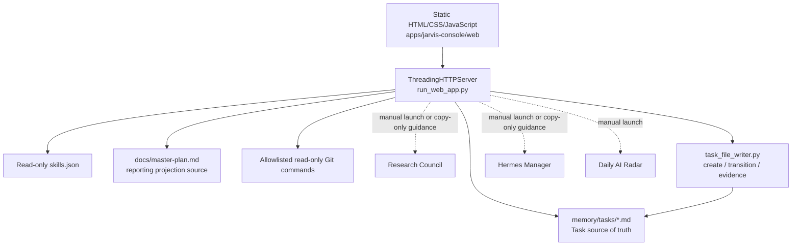
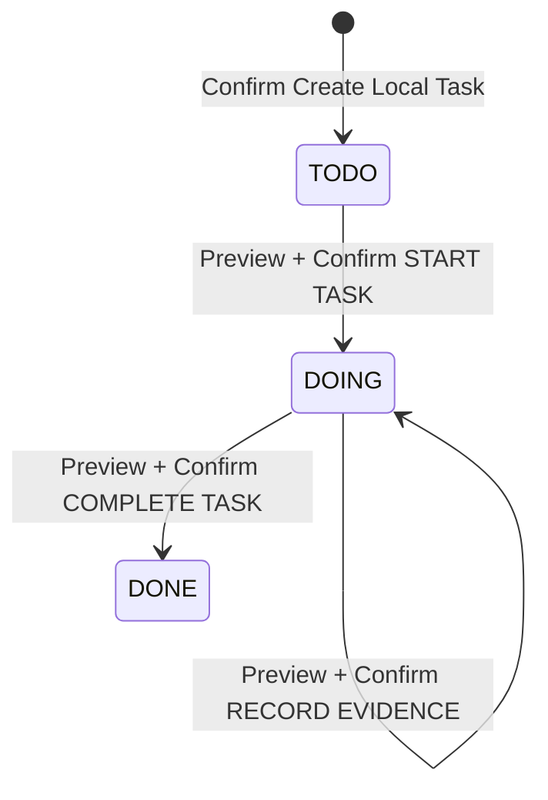

# Jarvis-Core ChatGPT Handoff

Last verified: 2026-09-09

Repository: `C:\work\jarvis-core`

Branch: `main`

Verified at HEAD: `ad59fb15fb1d9d38f73a6057f678f74bfc5d894f`

Historical reference — Open Created Task feature commit: `b80ed92901d0805e3064ef8f80c36654e48ee771`, `feat(console): open created task from receipt`. That commit is no longer the tip: 72 commits have landed since it, 41 of them touching product source.

This is the authoritative fast-start handoff for the repository's current implementation. It describes what the source actually does, not what an older design document intended. When this document conflicts with executable source, tests, or current local data, the source, tests, and data win and this document must be corrected.

Feature maturity in this document uses exactly one of these labels:

- **Implemented** — user-visible behavior or an internal primitive exists in source.
- **In Progress** — approved implementation work has started but has not reached its Definition of Done.
- **Proposed** — a bounded product proposal exists but implementation has not been approved or started.
- **Planned** — a future direction, locked capability, unselected issue, or maintenance item has no active implementation package.

Task values such as `TODO`, `DOING`, and `DONE` are data-model states, not feature-maturity labels.

## Project Overview

**Status: Implemented**

Jarvis-Core is a local-first, human-confirmed personal assistant repository. Its current daily-use center is Jarvis Console v0.1: a Python standard-library HTTP server with a static HTML/CSS/JavaScript UI at `http://127.0.0.1:8790/`.

The primary implemented user journey is the Voice Inbox flow:

```text
pasted transcript or rough thought
→ deterministic Task candidate
→ Create Local Task Preview
→ Confirm
→ authoritative Receipt
→ Open Created Task
→ exact TODO card visible and focused in Project Control
→ Start Task
→ Record Completion Evidence
→ Complete Task
```

An `Evaluate Idea` entry point preceded this one. It was removed; see **Removed Console Features**.

All repository writes available from Jarvis Console are bounded Task operations under `memory/tasks` and require Preview plus explicit Confirm. The Console does not execute Task work, infer completion, invoke another AI product, call an external API, or perform Git writes.

The repository also contains separately launched Hermes Manager, Research Council, Daily AI Radar, a legacy localhost read-only Task dashboard, and a minimal Discord adapter. Jarvis Console presents instructions or read-only integrations for these surfaces; it does not automatically start or invoke them.

Current local Git facts:

- Branch: `main`.
- Open Created Task feature commit: `b80ed92901d0805e3064ef8f80c36654e48ee771`, `feat(console): open created task from receipt`.
- Protected untracked file: `jarvis.bat`.
- The dogfood Task files `task-0006` through `task-0028` were real smoke/dogfood output, not committed test fixtures. They were removed on 2026-09-10 by the Owner decision recorded in task-0094.
- The Open Created Task feature commit contains only `apps/jarvis-console/web/app.js`, `apps/jarvis-console/run_smoke_tests.py`, and this handoff.

## Repository Structure

| Path | Status | Current responsibility |
| --- | --- | --- |
| `apps/jarvis-console/` | Implemented | Primary local browser product, API server, UI, registry, Project Control, Task flows, and deterministic tests. |
| `orchestrator/discord-intake/` | Implemented | Shared command parsing, Task draft creation, authoritative Task file writer, status transition writer, and completion-evidence writer. Despite the directory name, the writer is reused by Jarvis Console. |
| `memory/tasks/` | Implemented | Markdown Task source of truth. 73 Task files are tracked, spanning `task-0001` through `task-0121`. Tracked and on-disk contents now match; the 23 dogfood Tasks were removed by the task-0094 decision. |
| `apps/hermes-manager-pilot/` | Implemented | Separately launched local workflow-management app with prompt rendering, review handoff, durable Review lifecycle, content-evidence binding, and reporting primitives. |
| `apps/research-council/` | Implemented | Deterministic local idea-evaluation pipeline, desktop launcher, reports, profiles, golden cases, benchmark governance, and replay tools. |
| `apps/daily-ai-radar/` | Implemented | Deterministic renderer that converts manually curated technology metadata into a bounded radar report. |
| `adapters/web/` | Implemented | Older independent read-only Task dashboard at port `8765`; not the Jarvis Console UI. |
| `adapters/discord/` | Implemented | Optional minimal Discord bot adapter. It needs a Discord token and is not launched by Jarvis Console. It has its own command and allowlisted-execution boundaries. |
| `docs/` | Implemented | Contracts, designs, operating rules, Master Plan, and this handoff. Some older overview documents lag current source and are not implementation authority. |
| `reports/` | Implemented | Report templates and examples. Jarvis Console only discovers existing reports; it does not create them. |
| `scripts/` | Implemented | Research batch/comparison utilities and the Multi-Agent SOP validator. |
| `skills/` | Implemented | Markdown descriptions for early repository skills. Jarvis Console's runtime card registry is instead `apps/jarvis-console/skills.json`. |
| `configs/`, `prompts/` | Planned | Present as repository structure but currently contain no active product implementation. |
| `jarvis.bat` | Planned | Protected, untracked local launcher. Do not touch, add, stage, or commit it without an explicit Owner decision. |

## Current Architecture

**Status: Implemented**



### Runtime

- `apps/jarvis-console/run_web_app.py` owns the local server, API dispatch, validation, Task projections, in-memory authority registries, and self-tests.
- It uses `ThreadingHTTPServer` and binds to `127.0.0.1`; the default port is `8790`.
- `apps/jarvis-console/web/index.html`, `styles.css`, and `app.js` are served with `Cache-Control: no-store`.
- The frontend is vanilla JavaScript. There is no Node build, SPA framework, database, account system, or connector runtime.
- The server can open the default browser unless started with `--no-browser`.

### Source-of-truth precedence

1. Executable source and deterministic tests define current behavior.
2. `memory/tasks/*.md` defines Task state.
3. `apps/jarvis-console/skills.json` defines runtime skill cards and deterministic routing metadata.
4. `docs/master-plan.md` defines Project Control's reporting snapshot fields, but live Git evidence validates its referenced commits. A conflict is displayed as blocked; it is not silently repaired.
5. Current Git branch, HEAD, status, and bounded recent commit evidence come from allowlisted read-only Git commands.
6. README and design documents explain intent but do not override source. Root `README.md`, `docs/architecture.md`, and parts of `docs/master-plan.md` predate the current Stage 2 Task workflow.

### Write authority

- The server fixes the repository root, Task directory, path, Task ID allocation, timestamps, `repo`, `status`, and source metadata.
- Preview is write-free. It stores a canonical snapshot in process memory and issues short-lived authority only for the exact reviewed operation.
- Confirm receives a token and exact confirmation literal, not arbitrary Task metadata or paths.
- Create, transition, and evidence registries are process-local, capacity-bounded, lock-protected, and normally use a ten-minute token lifetime.
- Successful Confirm replay returns the same authoritative Receipt without a second write.
- Transition and evidence writes compare the current SHA-256 digest to the Preview snapshot and fail with `409` semantics when the file changed.
- Writer functions independently validate Task grammar immediately before mutation and atomically publish or replace files.

### Storage

- Tasks: repository-local Markdown under `memory/tasks`.
- Skill registry: repository-local JSON at `apps/jarvis-console/skills.json`, read-only at runtime.
- Master Plan and discovered artifacts: repository-local, read-only in Console.
- Create/transition/evidence authority: process memory only; restart invalidates it.
- Hermes durable Reviews: app-local state outside the repository when the user explicitly uses Hermes Save.

## Implemented Features

| Feature | Status | What exists now |
| --- | --- | --- |
| Jarvis Console local shell | Implemented | Localhost-only static browser UI and JSON API. |
| Deterministic skill suggestion | Implemented | Keyword-based routing from Chat / Command; suggestions and commands never auto-run. |
| Voice Inbox preparation | Implemented | Cleans a pasted transcript, suggests a skill, and derives a bounded Task candidate without recording audio or calling STT. |
| Create Local Task | Implemented | Preview → exact `CREATE LOCAL TASK` Confirm → one `TODO` Markdown Task → authoritative Receipt. |
| Open Created Task | Implemented | A successful authoritative Voice Create Receipt offers a user-selected GET-only action that activates Project Control and focuses the exact Receipt `task_id` card without starting it. |
| Read-only Actionable Task View | Implemented | Validates and groups up to ten recently discovered Task files. Status-only Next Action text is deterministic. Invalid metadata fails closed into metadata review. |
| Start / Complete Task | Implemented | Exact `TODO → DOING` and `DOING → DONE` transitions through Preview → Confirm → Receipt; only `status` and `updated_at` change. |
| Record Completion Evidence | Implemented | Appends one safe `completion_evidence` value to an eligible `DOING` Task and updates only `updated_at`; evidence is neither evaluated nor used to auto-complete. |
| Refresh Outcome Truthfulness | Implemented | A successful write Receipt stays authoritative even when the following Overview GET fails or is superseded. Last-good Overview remains visible, retry performs GET only, and stale GET responses cannot overwrite newer state. |
| Project Control | Implemented | One owner-facing Jarvis-Core card combining Master Plan fields, live Git state, reporting projections, recent milestone evidence, Task view, and existing artifacts. |
| Checkpoints / History | Implemented | Read-only recent commits and bounded local checkpoint/report metadata. |
| Hermes Manager | Implemented | Separate local app for bounded prompt/review/checkpoint workflows and explicitly managed durable Review records. It does not call Codex or ChatGPT automatically. |
| Research Council | Implemented | Separate deterministic CLI/desktop evaluation, report generation, golden cases, batch tools, and benchmark governance. |
| Daily AI Radar | Implemented | Separate deterministic CLI renderer over human-curated metadata; no crawler or automatic Task creation. |
| Legacy read-only Task dashboard | Implemented | Independent localhost Task list/detail/filter UI under `adapters/web`; no write routes. |
| Minimal Discord adapter | Implemented | Optional text-command bot surface. It is outside Jarvis Console and requires explicit setup and credentials. |

## Removed Console Features

**Status: removed from source.** These are neither Implemented nor Planned. They are not locked capabilities awaiting approval — the implementations were deleted, so reopening any of them requires a new package, not an unlock.

| Feature | Removed by | Evidence at current HEAD |
| --- | --- | --- |
| Evaluate Idea, editable Draft, Final Preview, Continue Evaluation as Task | task-0075 | `evaluate_idea`, `create_task_draft`, and `create_task_preview` appear 0 times in `run_web_app.py`; `evaluate` appears 0 times in `web/app.js` and `web/index.html`. |
| Codex Review | codex_review adapter deletion | `run_web_app.py:35` records "the deleted codex_review adapter". The `.codex-review-status` CSS class survives, but it labels the Project Control working-tree readout and is a naming vestige, not this feature. |
| Memory / Skills preview, inbox, and save primitives | task-0071, task-0074 | `memory_skills`, `memory_guarded_save`, and `candidate_preview` appear 0 times in `run_web_app.py`; `memory` appears 0 times under `web/`. |

The following routes were removed with them. Each returns HTTP 404 at the current HEAD:

```text
GET  /api/memory-skills
POST /api/evaluate-idea
POST /api/evaluate-idea/create-task-draft
POST /api/evaluate-idea/create-task-preview
POST /api/evaluate-idea/create-task-preview/invalidate
POST /api/codex-review/preview
POST /api/memory-skills/candidates/preview
POST /api/memory-skills/candidates
```

Entries in the Decision Log that record adding these features remain accurate history and are not corrections. They describe what was decided and built at the time.

## Current UI

**Status: Implemented**

The current Jarvis Console has eight sidebar tabs plus a persistent status panel:

| Tab | Status | Current behavior |
| --- | --- | --- |
| Chat / Command | Implemented | Accepts free text and returns a deterministic skill suggestion. |
| Voice Inbox | Implemented | Prepares a candidate from pasted text, hosts the Voice Create Preview/Confirm/Receipt flow, and lets the user open the exact created Task from an authoritative Receipt. |
| Skills | Implemented | Renders five registry cards and read-only usage details, commands, docs, tests, safety notes, and non-goals. |
| Hermes Manager | Implemented | Shows manual launch and usage guidance for the separate Hermes app. |
| Daily AI Radar | Implemented | Shows purpose, safety boundary, sample paths, and manual usage metadata. It does not run Radar. |
| Project Control | Implemented | Sidebar label `Project Control`, `data-tab="tasks"`; the registry `display_name` for the same surface is `Tasks / Reports`. Shows the owner card, Actionable Task View, Task action controls, reports/checkpoints/docs metadata, and explicit refresh. Open Created Task uses the existing Overview GET and visibly focuses only the exact Receipt `task_id` card. |
| Checkpoints / History | Implemented | Displays recent Git commit metadata and existing checkpoint/report artifacts. |
| Settings | Implemented | Displays local-only mode, protected `jarvis.bat`, and future-connector placeholders. |

The persistent right panel displays Current Status, Suggested Next Action, and Safety Notes. User-visible copy correctly states that discovery is read-only while explicitly confirmed Task creation, two status transitions, and one evidence append are the only Console writes.

Actionable Task View groups are `Needs metadata review`, `Needs attention`, `In progress`, `Ready`, and `Completed`. Since task-0114 the view scans every Task candidate, validates them, and then caps the priority-ordered projection, so attention items are not pushed out by newer files; it shows at most ten and is not a complete backlog.

Current Project Control projection at the observed HEAD:

- Project card: `attention`.
- Manager Report: `blocked`, Owner action `decision_required`.
- Director Report: `blocked`.
- Reason: the Master Plan's verified implementation HEAD and two Manager Reporting package commits are absent from the bounded live Git evidence window.
- Displayed Task counts: `Needs attention: 5`, `In progress: 1`, `Completed: 4`; `Needs metadata review: 0`; displayed total: `10`.

This reporting state is intentional fail-closed behavior. Do not weaken it or replace historical hashes merely to make the card green.

An earlier `Needs metadata review: 10` reading came from a defect, now fixed. `parse_task_view_text` treated every line beginning with `- ` anywhere in a Task file as metadata, so a record with an ordinary Markdown list in its body failed closed. task-0096 scoped the parser to the header block and task-0097 scoped the bounded read the same way, applying the boundary `task_file_writer.py` already carried for the same class of defect. All local Task records now parse as valid.

## Complete User Workflows

### Evaluate Idea to completed Task

**Status: removed.** This workflow no longer exists; its four `/api/evaluate-idea*` routes were deleted by task-0075. See **Removed Console Features**. The Voice Inbox workflow below is the current path from an idea to a completed Task.

### Voice Inbox to completed Task

**Status: Implemented**

1. Paste a transcript or rough thought. Jarvis does not record audio or run STT.
2. Select **Prepare Task Candidate** to see the cleaned text, deterministic skill suggestion, and bounded `title`/`summary`.
3. Select **Preview Create Local Task**. Preview sends only the transcript and writes nothing.
4. Review every persisted field and provisional relative destination.
5. Select **Confirm Create Local Task**. Confirm sends only the token and `CREATE LOCAL TASK`.
6. From the successful authoritative Receipt, select **Open Created Task**.
7. The existing Project Control tab activates and performs one existing read-only Overview GET.
8. If the exact Receipt `task_id` is in the bounded projection, its Task card scrolls into view, receives keyboard focus, and is visibly highlighted. No Start action runs.
9. Use the existing Start → Evidence → Complete sequence described above.

Voice Create is the only Create authority path. The Evaluate-to-Task Draft state it was once isolated from no longer exists.

### Read-only review and supporting apps

**Status: Implemented**

- Hermes Manager: launch its separate local app, prepare/confirm scope, manage a Review record, and copy an output-only handoff. It never reads the clipboard as workflow state and does not invoke Codex.
- Research Council: run the CLI or desktop launcher to create local deterministic report artifacts in an explicitly selected output directory.
- Daily AI Radar: run the CLI over curated JSON and optionally write one Markdown report to an explicitly supplied path.
- Legacy Task dashboard: browse and filter Markdown Tasks read-only at `127.0.0.1:8765`.

## API Endpoints

All endpoints are local to Jarvis Console. Static routes are `/`, `/web/index.html`, `/web/app.js`, and `/web/styles.css`. The complete API surface is four GET and eight POST routes, dispatched by `handle_get_api` and `handle_post_api` in `run_web_app.py`. Eight further routes named in earlier revisions of this document were removed; see **Removed Console Features**.

### GET

| Endpoint | Status | Behavior |
| --- | --- | --- |
| `/api/status` | Implemented | Console version/mode, registry state, protected paths, skills, and safety copy. |
| `/api/overview` | Implemented | Repository, Project Control, Actionable Task View inputs, reports, checkpoints, docs/examples, and discovery limits. Read-only GET. |
| `/api/history` | Implemented | Bounded recent commit and checkpoint/report metadata. Read-only GET. |
| `/api/skill?skill_id=<id>` | Implemented | One validated skill-registry card. |

### POST

| Endpoint | Status | Input and effect |
| --- | --- | --- |
| `/api/suggest-skill` | Implemented | Message text to deterministic registry routing; write-free. |
| `/api/voice-inbox/prepare` | Implemented | Pasted `transcript`; returns cleaned text and candidate; write-free. |
| `/api/create-local-task/preview` | Implemented | Voice flow accepts only `transcript`; normalizes and holds the canonical candidate, returns provisional relative destination and token; no file write. |
| `/api/create-local-task/confirm` | Implemented | Accepts only `token` and exact `CREATE LOCAL TASK`; creates one Task or replays the same Receipt. |
| `/api/task-transition/preview` | Implemented | Accepts only `task_id` and `start` or `complete`; reads one snapshot and returns the state triad plus token. |
| `/api/task-transition/confirm` | Implemented | Accepts only `token` and exact `START TASK` or `COMPLETE TASK`; changes only `status` and `updated_at`. |
| `/api/completion-evidence/preview` | Implemented | Accepts only `task_id` and `completion_evidence`; validates one safe value and snapshots the eligible `DOING` Task. |
| `/api/completion-evidence/confirm` | Implemented | Accepts only `token` and exact `RECORD EVIDENCE`; appends once and updates only `updated_at`. |

Write-capable feature routes preserve duplicate raw headers and duplicate JSON-key detection. They require exactly one local `Host`, same-origin `Origin`, approved JSON content type, bounded `Content-Length`, no query string, no `Transfer-Encoding`, and a body no larger than 64,000 bytes. The handler also rejects non-local clients.

## Data Model

### Task Markdown

**Status: Implemented**

Canonical Task files are direct children of `memory/tasks` and match:

```text
task-####-lowercase-ascii-slug.md
```

Required metadata, each on a single Markdown bullet using backtick-delimited values:

```text
- id: `task-####-slug`
- title: `...`
- status: `TODO|DOING|BLOCKED|DONE|FAILED|NEEDS_APPROVAL`
- repo: `...`
- created_at: `YYYY-MM-DD HH:MM UTC`
- updated_at: `YYYY-MM-DD HH:MM UTC`
- summary: `...`
```

Optional text fields:

```text
completion_evidence
source_command
execution_request
execution_result
execution_summary
```

Optional boolean fields accept only literal `true` or `false`:

```text
execution_candidate
executed
success
dry_run
```

Optional timestamp:

```text
execution_updated_at
```

`completion_evidence`, when present, must be immediately after `summary`. It is append-once, one line, NFC-normalized, 1–500 characters, and cannot contain newline, backtick, NUL, control, format, separator, or surrogate characters. An empty optional text metadata line is invalid; an empty `execution_updated_at` is allowed by the existing grammar.

Creation limits are `title` 120 characters, `repo` 80, `summary` 500, and optional `source_command` 80 after whitespace normalization. Creation always uses `TODO`. The writer never overwrites an existing Task.

### Other current models

| Model | Status | Authority |
| --- | --- | --- |
| Skill registry | Implemented | `apps/jarvis-console/skills.json`; five cards, registry version `0.1`, read-only. Registry values `available` and `planned` are card metadata, not this document's feature maturity. |
| Project Control snapshot | Implemented | Parsed from required bounded fields and tables in `docs/master-plan.md`, then reconciled with live Git evidence. |
| Create/transition/evidence records | Implemented | Private process-memory dataclasses behind feature-local locks; tokens are stored by digest. |
| Research Council result | Implemented | Deterministic dataclasses serialized to bounded JSON/Markdown projections. |
| Hermes Review Record | Implemented | Versioned immutable record in app-local storage outside the repository after explicit Save confirmation. |

## Task Lifecycle

**Status: Implemented**



Console transition authority is intentionally narrower than the full Task status enum:

| Current Task state | Status | Console behavior |
| --- | --- | --- |
| `TODO` | Implemented | Shows deterministic Next Action and offers Start Preview. Only `TODO → DOING` is allowed. |
| `DOING` without evidence | Implemented | Offers one Record Evidence Preview and Complete Preview. Complete remains a separate human decision. |
| `DOING` with evidence | Implemented | Evidence is read-only and cannot be edited, deleted, or appended again; Complete remains available. |
| `DONE` | Implemented | Read-only; no transition action. |
| `BLOCKED` | Implemented | Read-only; deterministic instruction says to clear the blocker outside Console. |
| `FAILED` | Implemented | Read-only; deterministic instruction says to decide recovery outside Console. |
| `NEEDS_APPROVAL` | Implemented | Read-only; deterministic instruction says to make the required decision outside Console. |
| Invalid metadata | Implemented | Fails closed into `Needs metadata review`; no Task mutation controls. |

Preview transition fields are Current State, Transition, and Proposed State. Receipt fields are Previous State, Transition, and Current State. They are derived from the same reviewed operation and must correspond exactly.

Complete does not require or validate `completion_evidence` at the server contract. The UI warns the user to confirm Complete only after verification evidence is recorded, but the human remains the authority.

## Current Dogfood Status

**Status: Implemented**

Environment recovery first established that PowerShell `Start-Process` failed when `-UseNewEnvironment`, `-RedirectStandardOutput`, and `-RedirectStandardError` were combined in the current Codex process environment containing both `PATH` and `Path`. No repository or system environment was changed. Launching the existing server without those options succeeded, health at `127.0.0.1:8790` succeeded, and a five-minute smoke dogfood ran for 314 seconds over three lifecycle cycles.

The upstream component that introduced both environment-key spellings remains **Unknown**; evidence only localizes the conflicting raw environment to the current Codex execution context.

The one-hour dogfood then ran from `2026-07-30T10:59:26.933Z` through `2026-07-30T11:59:29.075Z`, 3,602 seconds, with 20 repeated Voice Inbox cycles. All 20 performed:

```text
Create → Start → Evidence → Complete
```

All 20 final Tasks are `DONE`; all 20 contain completion evidence. At the time of that run the local directory held 28 Task files, all in `DONE`. It now holds 73: `DONE` 66, `NEEDS_APPROVAL` 6, `DOING` 1. Because Actionable Task View is capped after Recent Tasks selection, the UI displays only the newest ten. At the time of that run they showed as `Completed`; today they show as `Needs metadata review` for the reason recorded under Current UI.

Only observed friction is recorded:

1. In all 20 automated repetitions, the Evidence action was submitted once before filling the already-visible evidence field, producing `completion_evidence_invalid_value`, and then succeeded after the value was entered. The source confirms the field was already visible; this was not a hidden-field interaction.
2. The Create Receipt had no direct action to activate Project Control and focus the exact created Task in all 20 cycles.
3. After entering Project Control, the relevant Start button was measured roughly 13,497–16,144 CSS pixels below the document top in a 720-pixel viewport, requiring a long scroll.

The Open Created Task package implements a bounded resolution to findings 2 and 3 for future Voice Create use. The original observations remain historical evidence; no new post-implementation dogfood run has been recorded yet.

Do not turn unobserved UX ideas into dogfood findings.

## Active Work Package

**Status: Implemented**

Name: **Open Created Task**

Why now: the 20-cycle dogfood repeatedly showed that a successful authoritative Create Receipt does not help the user reach the just-created Task, while Project Control places its action far below the viewport. This is the most direct observed break between Create and Start.

Implemented boundary:

- A user-selected action appears only on a successful authoritative Voice Create Receipt.
- On selection, activate Project Control, perform only the existing Overview GET, locate the exact Receipt `task_id`, and focus/scroll that Task card.
- Keep the Create Receipt authoritative if refresh fails or a newer request supersedes the GET.
- Do not repeat Create Confirm, Start the Task, issue write authority, or add an endpoint.
- Implementation files: `apps/jarvis-console/web/app.js` and `apps/jarvis-console/run_smoke_tests.py`.
- First slice is Voice Create because that is the 20-cycle observed surface. Evaluate Receipt expansion is outside the first slice.
- Missing exact Task and Overview failure keep the Receipt intact and report a truthful no-open result; stale Overview responses do not focus or overwrite newer state.

No product implementation is **In Progress**. The Open Created Task package was implemented, locally focused-validated, and committed as `b80ed92`; 72 commits have landed since, so consult live Git rather than that hash for the current tip.

## Constraints

**Status: Implemented**

- Existing Multi-Agent SOP is the frozen development method. Do not add roles, reporting layers, Dispatcher, Runtime, Framework, KPI, or Approval Framework.
- Normal delivery order remains Manager → Implementer → Reviewer → QA → Director Report when the Owner approves implementation.
- Bind Jarvis Console to loopback only.
- Do not add external API, web, LLM, credential, connector, or unattended execution behavior without a separate explicit package.
- Do not make skill suggestions or AI output into execution authority.
- Do not auto-create, auto-start, auto-record evidence, auto-complete, or execute Tasks.
- Do not add a generic Task editor or generic state editor through an adjacent bounded feature.
- Keep server-owned Task IDs, paths, filenames, repo, status, timestamps, and metadata immutable from the client.
- Keep Create authority state isolated per flow. The Evaluate Draft state this rule was written for no longer exists; the rule stands for any future second Create path.
- Keep Preview write-free and Confirm token/literal-only.
- Keep receipts relative-path-only; do not expose absolute storage paths to the browser.
- Keep Git use in Console read-only and allowlisted. No stage, commit, push, PR, tag, merge, reset, checkout, clean, stash, or rebase.
- Do not touch or stage `jarvis.bat`.
- Do not use `git add .` or `git add -A` in approved implementation packages.
- Tests must not mutate production `memory/tasks`.
- Treat environment failures separately from product correctness when targeted contracts and tests pass.
- Push and PR are not authorized by default.

## Validation

### Available validation

| Suite | Status | Command |
| --- | --- | --- |
| Jarvis Console self-test | Implemented | `python -B apps/jarvis-console/run_web_app.py --self-test` |
| Jarvis Console smoke suite | Implemented | `python -B apps/jarvis-console/run_smoke_tests.py` |
| Hermes Manager smoke suite | Implemented | `python -B apps/hermes-manager-pilot/run_smoke_tests.py` |
| Research Council smoke suite | Implemented | `python -B apps/research-council/run_smoke_tests.py` |
| Research Council golden cases | Implemented | `python -B apps/research-council/run_golden_cases.py` |
| Daily AI Radar smoke suite | Implemented | `python -B apps/daily-ai-radar/run_smoke_tests.py` |
| Discord intake smoke suite | Implemented | `python -B orchestrator/discord-intake/run_smoke_tests.py` |
| Legacy dashboard smoke check | Implemented | `python -B adapters/web/run_smoke_check.py` |
| Multi-Agent SOP validator | Implemented | `python -B scripts/validate_multi_agent_sop.py` |
| Repository whitespace check | Implemented | `git diff --check` |
| Scope check | Implemented | `git status --short` |

`run_smoke_tests.py` covers registry copy-drift, Actionable Task View, reporting invariants, owner decision, recent milestone evidence, deterministic routing, refresh/Receipt separation, Open Created Task, Create Local Task, Start/Complete, evidence recording, and static UI contracts. It invokes the server self-test as part of the broad suite. It no longer covers Evaluate Idea, Edit Before Create, or Codex Review, because those features were removed.

### Current observed validation state

**Status: Planned**

The latest product commits were produced through focused validation, fresh Reviewer, and QA cycles, and the 20-cycle browser dogfood completed the full lifecycle. However, do not claim the entire current regression suite is green in this Windows/Codex session:

- On 2026-07-31, `python -B apps/jarvis-console/run_web_app.py --self-test` stopped in `run_memory_guarded_save_coordinator_self_tests`. That function no longer exists in the repository, so this specific failure cannot recur.
- The first visible failure was `save_status == HTTPStatus.OK`; the underlying response payload was not printed, so the exact assertion cause is **Unknown**.
- Cleanup then raised reproducible `PermissionError: [WinError 5]` while traversing a newly created temporary directory.
- Repeating with `TEMP` and `TMP` set to `C:\work` produced the same ACL behavior.
- During Open Created Task validation, the exact broad command `python -B apps/jarvis-console/run_smoke_tests.py` reached `_test_project_control_snapshot` and then reproduced `PermissionError: [WinError 5]` when creating `docs` below a fresh `jarvis-project-control-*` temporary directory.
- Focused product validation passed for Actionable Task View, Evaluate-to-Task client state, refresh truthfulness, and Open Created Task. The Open Created Task harness verifies Receipt-only exposure, exact `task_id`, existing Project Control activation, one Overview GET, no POST/write/Start, exact focus, missing/failure truthfulness, Receipt preservation, and stale-response suppression.
- The failures occur in Windows temporary-directory setup/cleanup, including both Project Control fixture setup and the then-present internal/tests-only Memory save subsystem. They do not contradict the focused Stage 2 Task tests or completed browser dogfood.
- Re-measured at the current HEAD in a non-Codex Windows session: `run_web_app.py --self-test` and `run_smoke_tests.py` both exit 0. Neither named blocker reproduced. This does not by itself prove the Codex execution context is fixed, because that environment was not re-tested; it does establish that the two recorded failures are not properties of the current source.

For documentation-only changes, do not launch the server or browser. Run `git diff --check`, inspect the exact diff, and inspect final `git status --short`.

## Frequently Modified Files

| File | Status | Why it changes |
| --- | --- | --- |
| `apps/jarvis-console/run_web_app.py` | Implemented | API routes, server validation, projections, token registries, reporting, and self-tests. High-risk because many product boundaries share one file. |
| `apps/jarvis-console/web/app.js` | Implemented | UI state machines, rendering, Preview/Confirm actions, Receipt preservation, refresh truthfulness, and exact Task focus from a Voice Create Receipt. |
| `apps/jarvis-console/run_smoke_tests.py` | Implemented | Broad deterministic integration, static copy, client-state, regression, and contract assertions. |
| `apps/jarvis-console/web/index.html` | Implemented | Static tab structure and user-visible safety copy. |
| `apps/jarvis-console/web/styles.css` | Implemented | Console layout and component styles. |
| `apps/jarvis-console/skills.json` | Implemented | Validated read-only skill cards, commands, routes, safety text, and protected paths. |
| `orchestrator/discord-intake/task_file_writer.py` | Implemented | Shared authoritative Task create/transition/evidence grammar and atomic filesystem operations. |
| `apps/jarvis-console/README.md` | Implemented | Current Console behavior and boundaries; update with source changes. |
| `docs/master-plan.md` | Implemented | Project Control reporting input. Update only through an explicit reporting maintenance decision, preserving evidence truth. |
| `docs/chatgpt-handoff.md` | Implemented | Current cross-repository handoff. Update in place; never create a second handoff file. |

## Technical Debt

| Item | Status | Impact and minimum handling |
| --- | --- | --- |
| Master Plan baseline is stale relative to live Git | Planned | Project Control correctly shows `attention`, Manager/Director `blocked`, and Owner action `decision_required`. Reconcile the reporting source through an explicit bounded documentation/reporting package; do not rewrite hashes or enlarge evidence windows to hide the conflict. |
| Broad Console self-test cannot be re-confirmed in the current Windows/Codex temp ACL environment | Planned | Product Task flows and dogfood remain usable, but full regression green cannot be claimed. Investigate the runner/filesystem ACL separately; do not mix the fix into a product feature. |
| Root overview documentation lags Stage 2 | Planned | `README.md`, `docs/architecture.md`, and portions of `docs/master-plan.md` describe earlier bootstrap/Project Control stages. Use this handoff and current source first; update older docs only in bounded packages. |
| Jarvis Console backend and self-tests are large single files | Planned | `run_smoke_tests.py` is about 224 KB and `run_web_app.py` about 176 KB. This raises review and static-assertion collision risk. No refactor is approved; keep feature changes narrow. |
| Voice Create Receipt navigation gap | Implemented | Confirmed in all 20 dogfood cycles and resolved by bounded Open Created Task. A post-implementation dogfood observation is not yet recorded. |
| Evidence can be submitted empty before succeeding | Planned | Observed in all 20 automated cycles. The input is already visible and the server correctly rejects empty evidence. No product change has been selected. |
| Dogfood Tasks are untracked local product data | Resolved | The Owner decided on 2026-09-10 to remove `task-0006` through `task-0028` rather than track them; see task-0094. Only `jarvis.bat` remains untracked. |
| Memory / Skills has no implementation to activate | Planned | The Console implementation and its internal save primitives were removed by task-0071 and task-0074; nothing remains to unlock. Reopening the workstream needs a new approved package, not an activation decision. |

## Roadmap

| Priority | Product or maintenance direction | Status | Next gate |
| --- | --- | --- | --- |
| 1 | Open Created Task from authoritative Voice Create Receipt | Implemented | Focused validation passed; feature commit `b80ed92`. |
| 2 | Reconcile stale Project Control reporting references | Planned | Separate maintenance decision; preserve historical evidence and fail-closed reporting. |
| 3 | Resolve Windows temp-directory ACL validation limitation | Planned | Separate environment package; no product-source change unless evidence requires it. |
| 4 | Decide whether observed Evidence-entry friction warrants a bounded slice | Planned | Compare actual dogfood value after priority 1; do not infer a generic editor. |
| 5 | Memory / Skills live save | Planned | The prior Console implementation was removed; this needs a new approved package built from scratch, not the unlocking of existing code. |
| 6 | Home server, mobile approval, background workers, automatic orchestration, external connectors | Planned | Long-term only; each expands authority and needs a separate explicit decision. |

Read-only Task Detail, Search/Filter, Canonical BLOCKED Workflow, and post-create Task correction have been considered previously but are not active packages. Edit Before Create was selected instead of general `TODO` correction because it solved the observed pre-create problem with less mutation authority.

## Decision Log

| Date | Decision | Status | Evidence |
| --- | --- | --- | --- |
| 2026-07-23 | Freeze Multi-Agent SOP as the default development method; do not expand organization or runtime. | Implemented | Commits `22b7398`, `c1e59aa`; `AGENTS.md`; `docs/jarvis-multi-agent-sop-v0.1.md`. |
| 2026-07-23 | Add deterministic Evaluate Idea. | Implemented | Commits `6ba8f2f`, `4c85dca`. |
| 2026-07-23 | Make Create Local Task the first Stage 2 daily-use write flow. | Implemented | Commits `beb7dae`, `8ecb72f`. |
| 2026-07-24 | Add read-only Actionable Task View with status-only deterministic Next Action. | Implemented | Commits `e1e0c0b`, `7759f93`, `e5140e2`. |
| 2026-07-24 | Permit only explicit Start and Complete transitions. | Implemented | Commits `ad730c4`, `bc74b53`, `2d33aac`, `064f82b`, `692a113`. |
| 2026-07-24 | Align Project Control, Manager, and Director reporting state instead of weakening tests. | Implemented | Commits `2cc20e4`, `20d2712`. |
| 2026-07-24 | Add one append-once Completion Evidence record without AI validation or auto-complete. | Implemented | Commits `23e2411`, `32714fa`. |
| 2026-07-27 | Continue a successful Evaluate recommendation into the existing Task Create authority. | Implemented | Commits `c4a1055`, `cdc461c`, `d0a6988`. |
| 2026-07-29 | Replace post-create `TODO` correction direction with Edit Before Create for Evaluate handoff only. | Implemented | Commits `511446f`, `925bcde`. |
| 2026-07-30 | Keep write Receipt authoritative and separate it from Overview refresh outcome. | Implemented | Commit `91e0006`. |
| 2026-07-30 | Recover Console launch without repository/system PATH changes, then complete five-minute smoke and one-hour/20-cycle dogfood. | Implemented | Local dogfood Tasks `task-0006` through `task-0028`; environment remained unchanged. Those 23 Task files were later removed on 2026-09-10; see task-0094. |
| 2026-07-31 | Implement direct GET-only navigation from an authoritative Voice Create Receipt to the exact Project Control Task card. | Implemented | Commit `b80ed92`; exact-path feature package and deterministic harness. |

## Glossary

- **Actionable Task View** — the bounded Project Control Task projection that validates, groups, sorts, and renders up to ten recently discovered Task files.
- **Authority** — server-held permission for one exact confirmed write. A Preview token is authority for only its canonical operation.
- **Canonical candidate** — server-normalized Task fields used for Preview and eventual write.
- **Confirm** — explicit user action sending a token and exact literal. It must not carry mutable Task metadata.
- **Dogfood** — using the actual Jarvis Console product repeatedly, not simulating a future UX.
- **Evidence** — user-entered `completion_evidence`. Presence does not prove quality, validation, or completion.
- **Last-good Overview** — the most recent successfully rendered Overview retained when a later refresh fails.
- **Metadata review** — fail-closed display group for a Task file that does not satisfy the frozen grammar.
- **Preview** — write-free projection of the exact proposed operation, normally coupled to a canonical snapshot and short-lived token.
- **Project Control** — the owner-facing single-repository dashboard within Jarvis Console.
- **Receipt** — authoritative server response after a confirmed write. A refresh error does not invalidate it.
- **Snapshot digest** — SHA-256 of the exact Task bytes read for Preview, used to reject stale writes.
- **Stale response** — a response from an older UI request/revision that must not overwrite newer state.
- **Task status** — one of `TODO`, `DOING`, `BLOCKED`, `DONE`, `FAILED`, or `NEEDS_APPROVAL`.
- **Token replay** — repeating a successful Confirm; it returns the same Receipt and performs no extra write.
- **Write-free** — may compute, validate, or hold in-memory state but does not persist a repository or app-state change.

## Quick Context

1. Start with `apps/jarvis-console/README.md`, then this document, then source. Treat root overview docs as potentially stale.
2. Run the Console with `python -B apps/jarvis-console/run_web_app.py --no-browser`, then open `http://127.0.0.1:8790/`.
3. The daily-use product flow is Voice → Create → Open exact Task → Start → Evidence → Complete.
4. Only confirmed Task create, two status transitions, and one evidence append write repository files.
5. `task_file_writer.py` is the authoritative shared Task grammar/writer even though it lives under `orchestrator/discord-intake`.
6. Preview is write-free; Confirm is token plus exact literal; server owns IDs, paths, status, repo, and timestamps.
7. Receipts are authoritative. Overview refresh is a separate GET outcome and must never cause a write retry.
8. Project Control currently shows reporting attention because `docs/master-plan.md` references old evidence. That is truthful behavior, not a UI bug.
9. Open Created Task was committed at `b80ed92` and remains in the product; no product work is currently In Progress. That hash is history, not the tip — use live Git for the current HEAD.
10. Open Created Task is Voice Receipt-only, performs one existing Overview GET, matches only authoritative `task_id`, and never starts the Task.
11. `jarvis.bat` and local dogfood Tasks are untracked; do not stage or alter them.
12. Do not claim full regression green in the current Windows/Codex session until the temp ACL issue is separately resolved.

## Maintenance Rules

**Status: Implemented**

1. Maintain this exact file in place: `docs/chatgpt-handoff.md`. Never create a competing handoff or versioned duplicate.
2. Verify branch, HEAD, `git status --short`, executable source, tests, `skills.json`, Task grammar, and relevant local data before changing factual claims.
3. When docs conflict with source, update this handoff to source behavior. Do not change source merely to make an old document true.
4. Classify every feature or future item as exactly one of **Implemented**, **In Progress**, **Proposed**, or **Planned**.
5. Do not describe Memory / Skills as an existing or merely locked feature. Its Console implementation and internal primitives were removed; live Memory save remains **Planned** and would need a new approved package.
6. Record dogfood findings only when observed in actual product use. Preserve counts, timestamps, surface, and exact failure behavior. Mark unverified causes **Unknown**.
7. Keep Project Control reporting truth separate from product correctness. A stale Master Plan reference can make reporting blocked without making Task flows defective.
8. Update Current UI, API Endpoints, Data Model, Complete User Workflows, Validation, Active Work Package, Technical Debt, Roadmap, and Decision Log whenever the corresponding implementation or approval state changes.
9. Update the observed HEAD and working-tree notes after meaningful local commits. Do not claim a commit, push, PR, or clean tree without direct evidence.
10. Preserve frozen safety boundaries: no automatic execution, AI completion judgment, external calls, Git writes, or protected-file changes.
11. For a documentation-only update, do not start servers or browsers. Validate with `git diff --check`, inspect the exact diff, and inspect final status.
12. Keep this document concise enough for a new ChatGPT to orient in roughly five minutes, but prefer a verified fact over a shorter unsupported claim.
