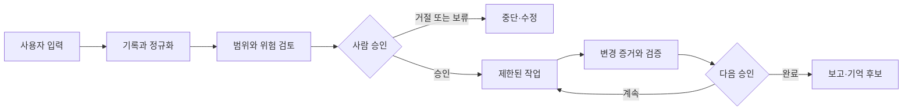

# Jarvis-Core Master Plan

이 문서는 Jarvis-Core의 전체 방향, 현재 작업 위치, 다음 승인 지점을 한곳에서 확인하기 위한 운영 계획서다.

세부 contract가 실제 구현 기준이며, 이 문서는 여러 contract와 앱의 상태를 한눈에 연결하는 상위 안내도다. 의미 있는 milestone이 끝날 때마다 이 문서의 `현재 위치`, `최근 완료`, `다음 단계`, `잠긴 기능`을 갱신한다.

## Owner Dashboard

### 최종 목표

Jarvis-Core 한 저장소 안의 AI 작업자와 내부 workstream을 한곳에서 관리하고,
사용자는 중요한 승인과 방향 결정만 수행한다. 기본 운영은 local-first이며
관찰, 제안, 승인, 실행을 서로 다른 단계로 유지한다.

### 현재 만드는 이유

Owner Decision v0.1A는 UI보다 먼저 transport-neutral core contract를 완성했고,
v0.1B는 그 객체를 기존 Project Control payload와 read-only renderer에 연결했다.
소유자는 이 객체에서 `Hermes Manager`를 선택했다. 첫 bounded package의 실사용
검토에서 clipboard를 workflow state처럼 읽는 설계 오류를 발견했고, 이를 frozen
in-memory Review 객체가 task와 scope를 소유하고 Copy가 언제든 같은 handoff를 다시
생성하는 구조로 수정했다. Durable Review Record v0.1A는 저장 당시 Git snapshot,
task, scope와 bounded result summary를 불변 객체로 고정하고, v0.1B-1 internal store는
그 객체를 repository 밖 app-local state에 append-only로 보존·조회할 기반을 제공한다.
v0.1C는 명시적 privacy/retention 확인, write-free preview, short-lived one-use
confirmation을 거쳐 Save/Reopen/exact Delete를 한 개의 local-only 사용자 흐름으로
연결했다. v0.1D는 저장된 Review의 target scope를 다시 명시적으로 확인하고 현재
branch·HEAD·exact `git status --short`가 일치할 때만 copy-only handoff를 재생성한다.
v0.1E는 기존 bounded evidence collector를 재사용하고 새 Review Record v0.1B에
content digest binding을 저장한다. Save 확인과 Reopen은 evidence를 다시 수집하며,
branch·HEAD·short status가 같아도 target bytes가 다르면 write/output을 차단한다.
v0.1F는 저장 목록에서 v0.1B의 live content check 가능 여부와 legacy v0.1A의
handoff 차단 상태를 행동 전에 보여준다. `content check ready`는 현재 일치 판정이
아니며, 실제 handoff 시 서버가 Git과 target bytes를 다시 검증한다.
legacy v0.1A는 읽기·복구·exact Delete만 유지하고 자동 migration하지 않는다. 화면은
review·commit 또는 잠긴 기능의 권한을 만들지 않는다.
v0.1G는 Save preview/confirm, content-verified handoff와 exact Delete가 로컬 검증을
수행하는 동안 즉시 진행 상태를 알리고 해당 control의 중복 실행을 차단한다.

Project Control v0.1D는 현재 목표와 live Git 상태에 더해 `현재 만드는 이유`,
`이 단계가 끝나면 사용자가 얻는 것`, 최근 완료, 다음 단계, 내부 workstream,
잠긴 기능, 승인 필요 여부를 한 개의 read-only Jarvis-Core 카드로 보여준다.
Project Control v0.1E는 최근 5개 로컬 커밋의 제목·hash·변경 파일과 live HEAD 일치를
같은 owner card에 표시해 별도 최근 작업 요약 요청을 줄인다. 커밋 제목은 검증이나
승인이 아니라 bounded read-only 작업 증거다.
v0.1B design과 v0.1C internal/tests-only registry primitive는 연결하지 않은
기반으로 보존하며 현재 방향은 multi-project 연결이 아니다. 두 번째 repo
등록·경로 입력·route·persistence는 추가하지 않는다. Memory / Skills live
save도 readiness review의 `keep locked` 판정을 유지한다.

### 이 단계가 끝나면 사용자가 얻는 것

- 명시적으로 저장한 Review 객체가 현재 task와 confirmed target-file scope에 묶인다.
- clipboard가 바뀌거나 output을 지워도 Review 객체에서 같은 handoff를 다시 만든다.
- Hermes는 clipboard를 programmatic input이나 session continuity 근거로 읽지 않는다.
- 작업 중 Review 객체는 page/session의 in-memory state이고, 별도 Durable Save를
  preview하고 확인한 경우에만 repository 밖 local state에 저장된다.
- 저장 전에 exact immutable Review Record와 retention/privacy disclosure를 확인한다.
- 저장된 Review를 bounded list에서 선택해 read-only로 다시 열고 exact ID recovery를 조회한다.
- 목록에서 v0.1B는 live content check 가능, legacy v0.1A는 handoff 차단임을 클릭 전에 구분한다.
- exact result-free Delete preview와 `DELETE <review_id>` 입력 후 그 한 건만 삭제한다.
- 저장된 Review가 현재 Git metadata와 target content에 모두 일치하면 scope 재확인 후
  같은 copy-only handoff를 다시 만들고, drift가 있으면 이유를 보여주고 출력을 차단한다.
- 오래 걸리는 Save/handoff/Delete 검증은 즉시 진행 상태를 보여주고 완료 전 중복 입력을 막는다.
- Project Control에서 최근 5개 로컬 커밋, 변경 파일과 현재 HEAD 일치를 바로 확인한다.
- 저장·재열기·삭제는 review/commit/push 권한이나 자동 실행을 복원하지 않는다.
- 자동 실행, push/PR, 외부 호출, Memory save는 계속 잠긴다.

### 전체 성숙도

아래 막대는 일정이나 공수 비율이 아니라 `설계 → 내부 구현 → 통합 검증 →
사용자 기능 → 실사용 검증`의 성숙도 위치를 뜻한다.

```text
운영 기반       ████░  사용자 기능
역할별 앱       ████░  사용자 기능
안전 작업 운영  ████░  사용자 기능 — 실제 작업 1건 검증
Memory / Skills ██░░░  내부 coordinator 구현 — 저장 잠금
통합 Console    ████░  사용자 기능 — 단일 프로젝트 카드
홈서버 / 모바일 █░░░░  장기 설계
```

상태 용어는 다음 의미로만 사용한다.

| 상태 | 의미 |
| --- | --- |
| 설계 | 방향과 안전 경계만 합의됐고 애플리케이션 코드는 없음 |
| 내부 구현 | 코드와 결정론적 테스트는 있으나 사용자 흐름에는 연결되지 않음 |
| 통합 검증 | 모듈 사이 연결과 end-to-end 로컬 검증까지 완료 |
| 사용자 기능 | 로컬 UI 또는 명확한 사용자 흐름에서 직접 사용할 수 있음 |
| 실사용 검증 | 실제 작업을 반복 수행하며 운영 피드백과 복구까지 확인됨 |

### 현재 위치와 다음 체감 목표

- 최근 완료: **Project Control Recent Milestone Evidence v0.1**
- 현재 다음 작업: **실제 milestone 보고에서 최근 작업 증거 카드를 반복 사용한 뒤 다음 workstream 선택**
- 현재 사용자 체감 결과: **최근 5개 커밋과 변경 파일, 현재 HEAD 일치를 한 화면에서 확인**
- 다음 사용자 체감 milestone: **반복 사용 피드백 또는 소유자가 선택한 다음 bounded vertical slice**
- 최근 검증 결과: 실제 browser에서 5개 commit card, HEAD verified, action button 0건, warning/error 0건
- 현재 결정 필요: **있음** — 반복 사용 후 다음 사용자 체감 workstream 선택

### 언제부터 실제로 편해지는가

1. 현재: 각 로컬 도구와 수동 prompt drafting 기능을 사용할 수 있다.
2. 첫 체감 milestone: 안전 검증을 통과한 Codex 작업만 read-only 검토 화면에서
   확인한다.
3. 실용 로컬 milestone: Jarvis-Core 내부 workstream의 진행·잠금·승인 필요 상태를
   통합 Console에서 확인하되 자동 실행과 push/PR은 계속 잠근다.
4. 장기 milestone: 화이트리스트 실행과 감사·복구가 검증된 뒤 모바일 승인을
   연결한다.

### 잠긴 고위험 기능

외부 API/LLM, Jarvis/Hermes UI가 촉발하는 자동 실행·stage·commit·push/PR,
Memory 저장, Voice auto-save, background worker, 모바일 원격 실행은 현재 모두
잠겨 있다. 승인된 Codex work package 안의 검증된 local commit 운영 규칙과 앱의
실행 권한은 서로 다른 경계다.
세부 목록과 재검토 조건은 아래 `잠긴 기능` 절을 따른다.

## 1. 한 문장 목표

Jarvis-Core를 **local-first, human-approved, skill-based personal AI assistant**의 지휘·기록·승인 중심축으로 발전시킨다.

Jarvis가 지향하는 기본 흐름은 다음과 같다.



자동화보다 승인 경계가 우선이다. 관찰, 제안, 승인, 실행은 서로 다른 단계이며 한 단계의 성공이 다음 단계의 권한을 자동으로 부여하지 않는다.

## 2. 현재 기준점

- Last verified: 2026-07-23
- Verified implementation HEAD: `325fe50`
- Branch: `main`
- Known protected untracked file: `jarvis.bat`
- Current goal: Develop Jarvis-Core as a local-first, human-approved, skill-based personal AI assistant
- Manager reporting milestone ID: `manager-reporting-v0.1`
- Manager reporting status: `in_progress`
- Manager reporting next package ID: `manager-reporting-v0.1c`
- Current workstream: Hermes Manager — Manager Reporting Workflow
- Current milestone: Manager Reporting v0.1B existing-evidence adapter completed
- Recommended next step: Connect the derived Manager Report to the existing read-only Project Control overview
- Next user-visible milestone: Owner가 milestone 의미, 사용자 결과, 위험과 실제 결정만 한 화면에서 확인
- Current reason: Codex Worker의 상세 결과를 Hermes Manager가 검토해 Owner에게 중요한 milestone 정보만 보고해야 한다
- Owner outcome: Owner는 파일별 구현 세부사항 대신 milestone 의미, 사용자 결과, 위험, 다음 추천과 필요한 결정만 확인한다
- Recent completed: Manager Reporting v0.1A immutable contracts and v0.1B pure evidence adapters
- Approval state: none
- Approval note: Manager Reporting v0.1D까지 승인된 milestone boundary 안에서 진행하며 escalation gate가 없으면 Owner action은 none이다
- Owner decision status: selection_required
- Owner decision recommendation: hermes-manager

Phase 2C-4a는 explicit privacy review가 있어야 preview token을 발급하고, exact
confirmation literal과 server-held canonical snapshot만 writer에 전달한다. Phase
2C-4b는 duplicate-preserving raw header pairs에서 exact single security header와
bounded Content-Length를 검증하고 request guard 입력을 만든다. 둘 다 route-free
internal/tests-only다. Phase 2C-4c/4d는 bootstrap 전용 same-origin/no-body 검증,
atomic issue/rotation, cookie/CSRF 분리, expiry/capacity/restart 경계를 설계하고
route-free primitive로 검증했다. Phase 2C-4e는 raw header/body framing, guard,
privacy review, canonicalization, session-bound token issue를 route-free로 묶었다.
Phase 2C-4f는 generic handler framing, live registry lifecycle, confirmation,
recovery, real HTTP/browser test gap 때문에 live save를 계속 잠그기로 판정했다.
저장 JSON은 `original_text_preview`를 제외한다. 현재 preview는 계속
write-free/token-free이고 save endpoint는 disabled/non-success다. UI Save/Confirm,
Voice Inbox auto-save, saved candidates dashboard도 없다.

## 3. 전체 단계

| 단계 | 완료 후 사용자가 할 수 있는 것 | 핵심 산출물 | 성숙도 | 다음 선행조건 |
| --- | --- | --- | --- | --- |
| 0. 운영 기반 | 작업·승인·결과를 같은 규칙으로 지시하고 보고받음 | task, 승인, 상태 전이, 보고 계약 | 사용자 기능 | 반복 실사용 검증 |
| 1. 역할별 앱 | 목적에 맞는 로컬 AI 도구를 분리해 사용함 | Research Council, Radar, Hermes, Console | 사용자 기능 | 실제 사용 피드백 |
| 2. 안전한 작업 운영 | 최신이며 범위 안인 Codex 작업만 검토함 | evidence, queue, copy-only handoff, read-only 검토 화면 | **사용자 기능 — 실제 작업 1건 검증** | 반복 사용 피드백 또는 다음 축 선택 |
| 3. Memory / Skills | 저장 전 후보를 확인하고 명시적으로 승인함 | write-free preview와 안전한 저장·복구 흐름 | 2C-4f readiness review 완료, `keep locked` | 소유자가 complete vertical slice 우선순위 결정 |
| 4. 통합 Jarvis Console | Jarvis-Core 내부 workstream의 진행·잠금·승인 필요 상태를 한 화면에서 확인함 | read-only부터 확장하는 single-repo local control panel | **사용자 기능 — v0.1D Owner Dashboard 검증** | 소유자가 다음 bounded slice 선택 |
| 5. 제한 실행과 모바일 승인 | 검증된 작업만 제한 실행하고 휴대폰에서 승인함 | 화이트리스트 executor, 감사 기록, 복구, 모바일 승인 | 장기 설계 | 로컬 실사용 검증 |

단계 번호는 방향을 설명한다. 모든 작업 축이 완전히 직렬로 진행된다는 뜻은 아니며, 안전 경계를 넘지 않는 작은 기반 작업은 병행할 수 있다.

## 4. 현재 위치: Prompt Queue / Project Control Panel


### Manager Reporting Workflow v0.1 package evidence

| Work package | Result type | Summary | Commit |
| --- | --- | --- | --- |
| manager-reporting-v0.1a | implementation | Immutable Worker and Manager reporting contracts | 325fe500a0cf3938eba2a7627fc8d8978cf0e2c3 |
| manager-reporting-v0.1b | implementation | Pure existing-evidence adapters with fail-closed source checks | a11c95365020fd39d928a75f1970cf59fd0c2b37 |

### 구현된 기반

- Prompt Queue in-memory project/item schema와 approval/evidence safety primitives
- Hermes copy-only `queue + item_id` handoff
- Jarvis Console fresh write-free Codex Review
- master-plan Owner Dashboard와 milestone 갱신 규칙
- bounded master-plan snapshot parser: trusted-root regular file, UTF-8, 128KB,
  required field, duplicate field validation
- 기존 `/api/overview` 안의 single-repo `project_control.v0.1E` payload
- Jarvis-Core 목표·milestone·live Git·보호 경계를 보여주는 read-only owner card

### 최근 완료: Project Control Recent Milestone Evidence v0.1

transport-neutral immutable contract는 caller-supplied separator-based Git log text만
정규화하고 Git·filesystem·route·persistence를 직접 사용하지 않는다. Console adapter는
trusted Jarvis-Core root에서 allowlisted `git log -n 5`만 실행해 기존
`GET /api/overview`의 `project_control.v0.1E` payload에 넣는다. 최대 5 commits, raw
256KB, commit당 visible path 20개 경계를 적용하고 malformed hash, traversal, duplicate,
control character와 oversized input을 fail closed로 차단한다.

Owner Dashboard는 최근 commit 제목·short hash·bounded changed files와 live HEAD 일치를
보여준다. mismatch 또는 최근 commit의 protected `jarvis.bat` 포함은 Attention이다.
커밋 제목은 검증·승인 근거가 아니며 section에는 action button이 없다. 실제 browser에서
5개 card, `HEAD verified`, implementation commit의 5개 변경 파일, zero action button과
zero warning/error를 확인했다. 새 route, persistence, second repo, 실행 권한은 없다.

### 최근 완료: Durable Review Reopen-to-Handoff v0.1D

사용자는 exact saved Review를 선택하고 저장된 target files가 현재 review scope임을
다시 확인한 뒤 `Copy Fresh Handoff`를 요청할 수 있다. 서버는 trusted Jarvis-Core의
branch·HEAD·complete `git status --short`를 한 번 새로 읽고 stored snapshot과 다르면
bounded reason을 반환하며 artifact를 만들지 않는다. blocked UI는 이전 generated
output도 비워 stale artifact 혼동을 막는다.

canonical directory target은 trailing slash로 표현하며 그 아래 path만 포함한다.
sibling-prefix path와 protected path를 포함하는 directory scope는 evaluator에서
차단한다. handoff 생성 과정은 Git porcelain의 첫 status column도 보존한다.

응답은 `freshness_basis=branch_head_status_only`, `git_metadata_matches=true`,
`content_evidence_verified=false`를 명시한다. 따라서 이미 modified 상태인 파일의
내용 동일성은 주장하지 않고 downstream read-only review가 content evidence를
수집해야 한다. regenerated item은 `review_passed=false`, `commit_approved=false`,
`push_allowed=false`이며 clipboard는 output only다.

구현 commit은 `e1ea7e4c664153276eb55dfde3dbdfea0da05ab4`다. isolated browser QA에서
scope 미확인 차단, metadata-matched handoff, status drift 차단, output clear와 zero
browser warning/error를 확인했다. QA store·server·temporary stale file은 제거됐다.

### 이전 완료: Durable Review Local Lifecycle v0.1C

transport-neutral Review Record와 route-free Store를 기존 Hermes browser UI에
local-only vertical slice로 연결했다. 사용자는 현재 frozen Review와 confirmed scope에
대해 privacy와 `manual_delete_only` retention을 각각 확인한 뒤 write-free Save preview를
본다. 5분짜리 one-use Save token은 local server session과 exact canonical record에
묶이며, confirmation 직전에 trusted Jarvis-Core Git snapshot을 다시 수집해 drift를
차단한다.

저장된 Review는 bounded metadata list에서 선택해 read-only로 다시 열 수 있다. exact-ID
recovery는 `present_valid`, `absent`, `present_corrupt`, `store_unavailable`만 보고하고
재시도·수리·삭제를 수행하지 않는다. uncertain post-publish Save는 generated ID를
반환해 blind retry 대신 recovery lookup을 안내한다.

Delete preview는 result text 없이 ID·timestamp·task·branch·HEAD·target count·digest와
`DELETE <review_id>` literal을 보여준다. Delete token은 Save token과 domain-separated고
single-use다. 삭제 직전 canonical bytes, preview digest와 file identity를 재검증하며
missing/changed/corrupt target은 삭제하지 않는다. bulk/glob/auto cleanup은 없다.

local routes는 loopback address와 Host, exact same-origin Origin, JSON, memory-only local
session header를 요구한다. frame/CSP 방어도 추가했다. 구현 commit은
`2d564e544a32c2ce839364fd3ba8cf76e9f70abb`이다. isolated browser QA에서 Save preview,
Save, list, read-only Reopen, `present_valid`, exact Delete, `absent`를 확인했고 warning/error는
0건이었다. QA state는 제거됐고 default/repository-local store는 생성되지 않았다.

### 이전 완료: Durable Review Store v0.1B-1 internal primitives

v0.1A canonical Review만 취급하는 route-free `review_store.py`를 추가했다. 기본
state root는 Windows `%LOCALAPPDATA%\Jarvis-Core`, 그 외 `~/.jarvis-core`이며,
Review는 `hermes-manager/reviews/v1` namespace에 위치한다. absolute
`JARVIS_LOCAL_STATE_DIR` override를 지원하지만 repository 내부, relative path,
symlink/reparse chain은 차단한다.

writer는 private exclusive temp file을 flush/fsync한 뒤 hard-link로 atomic
no-overwrite publish하며 기존 ID를 수정하지 않는다. exact reader는 safe ID,
regular/non-reparse file, size, strict UTF-8, stable file metadata, canonical bytes와
filename/internal ID 일치를 재검증한다. index-free list는 최대 256개 Review의
ID·timestamp·task·branch·HEAD·target count만 newest-first로 반환한다.

capacity overflow, foreign entry, orphan temp, corrupt/noncanonical record는 fail
closed다. corrupt store에서는 새 append도 차단하고 exact known-ID read는 unrelated
orphan temp가 있어도 가능하다. retention은 `manual_delete_only`이며 auto-expiry,
eviction, cleanup, delete, migration은 없다. 구현 commit은
`dbe7ffa8d558f145f32d6d24c40262e87ff13f51`이다. 실제 app-local Review store는
생성되지 않았고 전체 Hermes/Jarvis regression이 통과했다.

### 이전 완료: Durable Review Record v0.1A transport-neutral core

Hermes UI나 저장소가 Review 구조를 정의하지 않도록 frozen/slotted
`ReviewGitSnapshot`, `ReviewRecordCandidate`, `ReviewRecord` 계약을 독립 모듈로
구현했다. 계약은 고정된 Jarvis-Core identity, 저장 당시 branch·HEAD·status,
현재 goal/task, canonical target scope, validation command, bounded prompt/result
summary와 explicit privacy assertion을 보관한다.

정규화는 staged change, 범위 밖 변경, duplicate/unsafe path, malformed status,
`jarvis.bat` 누락이나 target 포함, unknown/oversized input을 fail closed로 차단한다.
Review ID는 사용자 text와 독립적으로 생성되고 canonical JSON은 stable round-trip을
지원한다. pure freshness decision은 현재 Git snapshot이 달라지거나 보호·scope
경계가 깨지면 matching Review를 반환하지 않는다.

모든 레코드는 `review_input_only`, `read_only=true`, `review_passed=false`,
`commit_approved=false`, `push_allowed=false`로 고정된다. 구현 commit은
`71d52dbb3c099cb10b1f35ab9b4dfaaa338f81e8`이다. 전체 Hermes/Jarvis smoke와
self-test가 통과했다. v0.1A는 filesystem/Git read, route, UI, clipboard input,
persistence, retention/deletion, external call 또는 execution을 추가하지 않았다.

### 이전 완료: Hermes Review object authority / clipboard output-only correction

실사용 검토에서 `Paste Result & Copy Jarvis Review Handoff`가 현재 clipboard를
workflow state처럼 읽고 session continuity를 그 값에 의존하는 설계 오류를 확인했다.
잘못된 one-click input은 제거하고, 사용자가 visible field의 결과를 명시적으로
저장하면 frozen Review 객체가 active task와 confirmed target-file scope를 함께
보관하도록 수정했다.

`Copy Jarvis Review Handoff`는 현재 textarea나 clipboard를 읽지 않고 저장된 Review
객체가 session과 일치할 때만 기존 `/api/review-handoff`를 호출한다. output을 지운 뒤
두 번 재생성한 handoff가 byte-for-byte 동일했고, `result_type=review`,
`review_passed=false`, `commit_approved=false`, empty commit message와 zero browser
warning/error를 확인했다. 앱에는 `navigator.clipboard.readText`와 clipboard input
button이 없다.

초기 one-click commit `4772eda8878842af47f87bc6e57d626d75c8e609`의 clipboard
state 설계는 correction commit `76fc6a4ebb0fcf7f953d33a576686769fc500c20`에서
대체됐다. Review 객체는 아직 page/session 한정 in-memory state이며 reset, 새 session,
reload에서 사라진다. persistence와 cross-device continuity는 별도 계약 전까지
추가하지 않는다.

### 이전 완료: Owner Decision v0.1B read-only Console integration

bounded master-plan snapshot을 v0.1A core로 정규화하는 pure data adapter를 추가하고,
직렬화된 객체를 새 route 없이 기존 `/api/overview`의 single-repo Project Control
payload에 포함했다. browser renderer는 contract/version/read-only 경계를 확인한 뒤
6개 후보, 사용자 결과, 계속 잠기는 기능, 추천, conversation response template을
읽기 전용으로 표시한다. 선택·승인·저장·실행 button이나 form은 없다.

deterministic self-test/smoke와 JavaScript syntax check가 통과했다. local browser
QA에서 Owner Decision section 1개, 후보 6개, 추천 1개, button/form control 0개,
console warning/error 0개를 확인했다. 구현 commit은
`e6305a7d4833bdeb3264bab09cfaacc5bcf6f267`이며, 완료 뒤에도 유효한 다음 결과와
`Hermes Manager` recommendation을 맞춘 self-review correction commit은
`e6ef70b15a9c3d7f15369b7baf1b5008ea0ab10f`다.

### 이전 완료: Owner Decision Contract v0.1A transport-neutral core

UI가 Decision 구조를 정의하지 않도록 frozen/slotted `OwnerDecision`과 candidate
contract, fail-closed normalization, canonical JSON serialization, pure Markdown
renderer를 독립 모듈로 구현했다. 정확한 6개 내부 workstream과 proposal-only
authority를 고정하고 unknown/duplicate/malformed/oversized 입력, 상태와 선택의 불일치,
noncanonical 직접 객체를 차단한다.

로컬 CLI는 bounded JSON을 stdin에서만 받고 Markdown 또는 canonical JSON을
stdout에만 쓴다. 파일·route·payload·UI·persistence·external API·background worker와
연결하지 않았다. deterministic contract/renderer/CLI test와 전체 Jarvis Console
self-test/smoke가 통과했다. 구현 commit은
`58d4767d4f7c3ca53bff4cebd195d9c15665d91a`다.

v0.1B adapter와 UI는 이 core contract를 소비만 하며 구조나 authority를 재정의하지
않는다.

### 이전 완료: Owner Decision Workflow v0.1 design

Project Control이 `Approval required`를 정확히 보여준 다음, 제품 방향 선택을
Prompt Queue approval metadata, task `/approve`, Memory confirmation 또는 구현
승인과 섞지 않는 별도 copy-only 운영 계약을 설계했다. 소유자가 선택할 수 있는
범위는 Jarvis-Core의 기존 6개 내부 workstream이며, 선택은 exact bounded work
package 제안만 허용한다. 모호한 `진행`, dashboard 상태 또는 digest는 선택으로
취급하지 않는다.

설계는 route, UI action, persistence, runtime state를 추가하지 않는다. 첫 사용자
체감 후보로 기존 Owner Dashboard에 선택지·안전 결과·복사용 결정 형식을 보여주는
`Jarvis Console` read-only slice를 권장하지만, 이 권장은 소유자의 선택이나 구현
승인이 아니다.

상세 계약은
[Owner Decision Workflow v0.1 design](project-control-owner-decision-workflow-v0.1-design.md)에
기록했다.

### 이전 완료: Project Control v0.1D 첫 실제 milestone 보고 검증

최신 `main`의 깨끗한 working tree(`?? jarvis.bat` 제외)를 Project Control에서
읽었다. 별도 문서를 열지 않고 현재 이유, owner outcome, 최근 완료, milestone,
다음 단계, 잠금, 승인 상태와 6개 내부 workstream을 확인할 수 있었다. Project
Control card의 action button과 browser error는 모두 0건이었다. 앱 코드 수정이
필요한 가독성 finding은 없었다.

이 검증으로 v0.1D 목표는 완료됐다. 다음 product workstream은 Dashboard가
자동으로 선택하지 않으며 소유자의 명시적 방향 결정이 필요하다.

구현 commit `e69dbea27a1f77d0b9fe40fc4f5ca76eb13e37fb`에서 기존 master plan과
`GET /api/overview`를 재사용하는 complete vertical slice를 구현했다. Owner
Dashboard는 `현재 만드는 이유`와 `이 단계가 끝나면 사용자가 얻는 것`을 기술
단계보다 먼저 보여주고, 내부 workstream 상태·최근 완료·현재 milestone·다음
단계·잠긴 기능·승인 필요 여부를 한 개의 Jarvis-Core 카드 안에 표시한다.
결정론적 smoke test와 local browser QA에서 6개 workstream, zero action button,
zero browser error를 확인했다.

기반으로 보존된 v0.1C는 v0.1B contract를 `project_control_registry.py`의
route-free internal/tests-only primitive로 구현했다. 1~16개 프로젝트의 in-memory
mapping을 immutable record로 정규화하고 server-supplied
trusted-root-key/validation-command-ID set에 없는 값은 차단한다.

unknown field, duplicate ID/path/command, traversal, drive/backslash, control
character, hidden/non-Markdown master plan, Windows alternate stream/wildcard,
trailing dot/space, reserved device name을 fail closed로 검증한다. one/two-project
fixture와 bounded blocking decision을 smoke test에 추가했다. filesystem, Git,
HTTP, UI, persistence나 실제 두 번째 repo 연결은 없다.

### 최근 완료: Durable Review Content Evidence Binding v0.1E / Readiness v0.1F / Progress v0.1G

v0.1D는 branch·HEAD·exact short-status revalidation까지만 수행했다. v0.1E는 기존
bounded `LocalChangeEvidence` collector를 재사용하고 새 Review Record v0.1B에
type/version/coverage/count/size/digest binding만 저장한다. raw content와
collector의 absolute repo path는 record에 저장하지 않는다. directory scope는 exact
Git-visible changed descendant로 materialize하며 sibling prefix와 protected
`jarvis.bat`는 포함하지 않는다.

legacy v0.1A record는 list/read/recovery/exact Delete 호환을 유지하지만 content-verified
handoff는 차단한다. 현재 bytes를 historical evidence로 자동 backfill하거나 record를
rewrite하지 않는다. Save preview와 Reopen-to-Handoff는 write-free이며 Save confirmation만
동일 evidence 재수집 후 append-only record를 쓴다. deterministic end-to-end는 동일
short status의 byte drift를 실제 차단하고 matching content를 허용함을 검증했다.
evidence는 approval이 아니며 자동 app call, prompt execution, commit/push도 추가하지
않는다.

v0.1F는 existing bounded list에 validated record의 version과 content-evidence
availability만 추가한다. UI는 v0.1B를 `content check ready`, v0.1A를
`legacy - fresh handoff blocked`로 표시하고 known legacy를 선택하면 handoff control을
비활성화한다. ready 표시는 현재 content 일치를 주장하지 않으며, 실제 서버 검증이
계속 authoritative하다. 실제 브라우저에서 두 상태와 zero warning/error를 확인했다.
route, persisted record, migration, 권한은 추가하지 않았다.

owner-visible real-work QA는 actual Jarvis-Core working tree의 transient scoped 문서와
격리 Review store를 사용했다. browser에서 preview/Save/list/read-only Reopen을 수행한
뒤 Git short status를 유지한 byte drift가 output 없이 차단되는지 확인했다. 원본 bytes를
복원한 뒤 content-verified handoff가 반복해서 동일하게 생성됐고, exact Delete 후 recovery는
`absent`였다. QA record, state, server, transient 문서는 모두 제거했고 warning/error는 없었다.
로컬 evidence 확인이 진행되는 수 초 동안 이전 status가 남는 UX risk도 관찰했다.
v0.1G는 Save preview/confirm, content-verified handoff, Delete preview/confirm 시작 시
즉시 operation-specific status를 표시하고 실행 중 control을 비활성화한다. 접근 가능한
live status, 중복 실행 차단과 success/failure cleanup을 결정론적 테스트로 고정했고,
실제 browser와 cross-app regression을 통과했다. route, persistence와 권한은 바꾸지 않았다.

v0.1B/v0.1C multi-project registry 기반은 route-free internal/tests-only 상태로
보존한다. 실제 두 번째 repository 등록, 경로 입력, route 연결, UI 노출,
persistence는 하지 않는다. Memory save endpoint, UI Save/Confirm, Voice Inbox
save도 계속 잠겨 있다.

## 5. 작업 축별 상태

| 작업 축 | 현재 상태 | 사용자에게 보이는 기능 | 다음 안전 단계 |
| --- | --- | --- | --- |
| Hermes Manager | 실제 Review owner flow와 lifecycle progress v0.1G 검증 완료 | prompt drafting, local Save/list/Reopen/recovery/Delete, content-ready/legacy 표시, content-verified handoff Copy, 즉시 progress와 중복 실행 차단 | 다음 owner workstream 선택 전 안정 상태 유지 |
| Memory / Skills | Phase 2C-4f readiness review 완료, `keep locked` | write-free preview | 잠금 유지, 별도 재승인 전 변경 없음 |
| Jarvis Console | Project Control v0.1E Recent Milestone Evidence와 Owner Decision 완료 | owner project card, 최근 5개 commit/변경 파일/HEAD 일치, 내부 workstream 상태, fresh read-only work review | 실제 milestone 보고에서 반복 사용 후 다음 bounded slice 선택 |
| Research Council | 결정론적 로컬 research/report 앱 | 아이디어·가설·risk 평가 | 실제 사용 피드백 기반 품질 개선 |
| Daily AI Radar | 수동 curated metadata 기반 scout | local radar report | 실제 source 수집은 별도 승인 후 검토 |
| Task / Discord / Dashboard | task 생성·조회·승인·보고 기반 구현 | task workflow와 read-only dashboard | 전역 동작을 넓히지 않고 유지보수 |

## 6. 잠긴 기능

다음 항목은 구현 기반이 일부 존재하더라도 사용자 기능으로 활성화되지 않았다.

- `POST /api/memory-skills/candidates` save endpoint
- Memory / Skills UI Save 또는 Confirm
- Voice Inbox auto-save
- Saved candidates dashboard
- Hermes의 자동 Codex/ChatGPT 호출
- 자동 prompt rendering 또는 실행
- Jarvis/Hermes 앱이 촉발하는 자동 stage, commit, push, PR
- 외부 API, LLM, credential 생성·저장
- background worker, scheduler, unattended execution
- 모바일 승인 또는 홈서버 상시 실행

잠긴 기능은 관련 design/reopen 조건, local validation, self-review, 사용자 승인을 모두 통과한 별도 work package에서만 재검토한다.

## 7. 고정 안전 원칙

1. Local-first: 기본 동작은 로컬 deterministic 경계 안에 둔다.
2. Human-approved: 관찰 결과나 digest를 사람 승인으로 취급하지 않는다.
3. Small safe steps: 설계, primitive, integration, UI를 한 번에 열지 않는다.
4. Fail closed: 불완전하거나 오래되거나 범위 밖인 상태는 진행이 아니라 차단으로 분류한다.
5. No auto publish: push와 PR은 자동화하지 않는다.
6. Protected file: `jarvis.bat`는 명시적 별도 요청 없이는 touch/add/stage/commit하지 않는다.
7. No secrets: API key, token, credential, 민감 내용을 repo에 저장하지 않는다.
8. Evidence is not authority: hash와 manifest는 변경 감지 수단이며 신원·승인·실행 권한이 아니다.

## 8. 사용자 체감 전달 규칙

내부 primitive가 사용자 기능보다 끝없이 앞서지 않도록 다음 규칙을 적용한다.

1. 내부 구현 work package는 최대 2개까지만 연속 진행한다.
2. 그다음에는 반드시 사용자에게 보이는 작은 vertical slice를 완성한다.
3. 안전상 내부 작업이 더 필요하면 이유와 사용자 체감 milestone 지연을
   설명하고 소유자의 명시적 승인을 받는다.
4. C0C-6a 이후 허용된 다음 내부 단위는 C0C-6b 하나다.
5. C0C-6b 다음 기본 작업은 `Codex 작업 읽기 전용 검토 화면`이다.
6. vertical slice는 실제 로컬 작업 하나로 end-to-end 검증해야 완료로 기록한다.
7. read-only vertical slice는 자동 연결이 아닌 copy-only handoff로 실제 작업
   1건을 end-to-end 검증해 완료했다.
8. Memory / Skills는 2C-4f readiness review의 `keep locked` 판정을 유지하며,
   소유자는 다음 체감 milestone로 Prompt Queue / Project Control을 선택했다.
9. Project Control v0.1A는 단일 owner card를 검증하고 v0.1B는 source contract,
   v0.1C는 route-free internal normalizer를 완료했다. v0.1B/v0.1C는 연결하지
   않은 기반으로 보존하며, 현재 제품 방향은 Jarvis-Core 한 저장소의 내부
   workstream 가시성이다. v0.1D는 owner summary와 workstream 표의 bounded
   source, payload, UI, deterministic test, local browser validation을 완료했다.

## 9. Milestone 보고 형식

각 의미 있는 milestone 보고에는 다음을 포함한다.

1. Result type: design / implementation / review / commit / blocked
2. 변경 내용
3. 변경 파일
4. validation 결과
5. safety boundary 결과
6. commit hash
7. 최종 `git status --short`
8. 남은 risk
9. 다음 권장 단계와 승인 필요 여부
10. 소유자가 30초 안에 이해할 수 있는 `상사 보고 요약`

## 10. 이 문서 갱신 규칙

작은 내부 work package마다 이 문서를 수정하지 않는다. 관련 커밋 2~4개가
하나의 의미 있는 milestone을 만들었을 때 묶어서 갱신한다. 다음 사건은 즉시
갱신 사유다.

- milestone 완료
- 현재 작업 축 변경
- 사용자에게 보이는 기능 추가
- 잠긴 기능의 상태 변경
- 중요한 blocker 또는 설계 변경

갱신할 때는 다음 항목을 최소 확인한다.

1. Owner Dashboard의 현재 작업, 다음 체감 milestone, 결정 필요 항목
2. `현재 기준점`의 verified implementation HEAD와 milestone
3. `현재 위치`의 완료/현재/후속 표시
4. 작업 축별 `다음 안전 단계`
5. 새로 열렸거나 계속 잠겨 있는 기능

오래된 세부 문서를 삭제하지는 않는다. 대신 루트 README와 최신 checkpoint에서 이 문서를 현재 전체 방향의 시작점으로 링크한다.

## 11. 관련 기준 문서

- [Codex operating rules](codex-operating-rules.md)
- [Project North Star](project-north-star.md)
- [Architecture](architecture.md)
- [Jarvis development loop](jarvis-dev-loop.md)
- [Jarvis Console checkpoint](jarvis-console-v0.1-checkpoint.md)
- [Codex review read-only design](codex-review-read-only-v0.1-design.md)
- [Codex review copy-only handoff design](codex-review-copy-handoff-v0.1-design.md)
- [Hermes Durable Review Local Lifecycle v0.1C/v0.1D](hermes-durable-review-lifecycle-v0.1.md)
- [Hermes Durable Review Content Evidence Binding v0.1E design](hermes-durable-review-content-evidence-v0.1-design.md)
- [Project Control dormant multi-project source design](project-control-multi-project-source-v0.1-design.md)
- [Project Control single-repo workstream visibility design](project-control-single-repo-workstreams-v0.1-design.md)
- [Project Control Owner Decision Workflow design](project-control-owner-decision-workflow-v0.1-design.md)
- [Memory / Skills design](memory-skills-v0.1-design.md)
- [Memory / Skills session bootstrap design](memory-skills-session-bootstrap-v0.1-design.md)
- [Hermes Manager README](../apps/hermes-manager-pilot/README.md)
- [Hermes Manager contract](../apps/hermes-manager-pilot/contracts/hermes-manager-pilot-v0.1.md)
