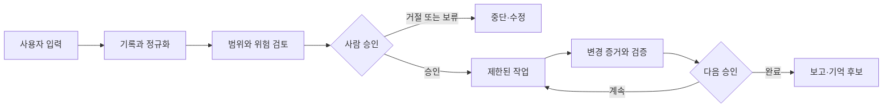

# Jarvis-Core Master Plan

이 문서는 Jarvis-Core의 전체 방향, 현재 작업 위치, 다음 승인 지점을 한곳에서 확인하기 위한 운영 계획서다.

세부 contract가 실제 구현 기준이며, 이 문서는 여러 contract와 앱의 상태를 한눈에 연결하는 상위 안내도다. 의미 있는 milestone이 끝날 때마다 이 문서의 `현재 위치`, `최근 완료`, `다음 단계`, `잠긴 기능`을 갱신한다.

## Owner Dashboard

### 최종 목표

Jarvis-Core 한 저장소 안의 AI 작업자와 내부 workstream을 한곳에서 관리하고,
사용자는 중요한 승인과 방향 결정만 수행한다. 기본 운영은 local-first이며
관찰, 제안, 승인, 실행을 서로 다른 단계로 유지한다.

### 현재 만드는 이유

Owner Decision v0.1A는 UI보다 먼저 transport-neutral core contract를 완성했고,
v0.1B는 그 객체를 기존 Project Control payload와 read-only renderer에 연결했다.
현재 과제는 소유자가 같은 Decision 객체에서 6개 내부 workstream의 사용자 결과와
잠금을 비교한 뒤 다음 제안 대상을 명시적으로 고르는 것이다. 화면은 선택·구현·commit
또는 잠긴 기능의 권한을 만들지 않는다.

Project Control v0.1D는 현재 목표와 live Git 상태에 더해 `현재 만드는 이유`,
`이 단계가 끝나면 사용자가 얻는 것`, 최근 완료, 다음 단계, 내부 workstream,
잠긴 기능, 승인 필요 여부를 한 개의 read-only Jarvis-Core 카드로 보여준다.
v0.1B design과 v0.1C internal/tests-only registry primitive는 연결하지 않은
기반으로 보존하며 현재 방향은 multi-project 연결이 아니다. 두 번째 repo
등록·경로 입력·route·persistence는 추가하지 않는다. Memory / Skills live
save도 readiness review의 `keep locked` 판정을 유지한다.

### 이 단계가 끝나면 사용자가 얻는 것

- CLI와 Console이 같은 immutable Decision 객체를 읽고 Markdown과 browser에서
  일관된 선택 경계를 보여준다.
- CLI는 bounded JSON을 stable JSON 또는 Markdown으로 stdout에만 렌더링한다.
- UI가 workstream, 상태, 권한 또는 응답 형식을 자체적으로 정의하지 않는다.
- 선택이 허용하는 것은 bounded work package 제안뿐이며 별도 구현 승인과 섞이지
  않는다.
- 자동 실행, push/PR, 외부 호출, Memory save는 renderer와 무관하게 계속 잠긴다.

### 전체 성숙도

아래 막대는 일정이나 공수 비율이 아니라 `설계 → 내부 구현 → 통합 검증 →
사용자 기능 → 실사용 검증`의 성숙도 위치를 뜻한다.

```text
운영 기반       ████░  사용자 기능
역할별 앱       ████░  사용자 기능
안전 작업 운영  ████░  사용자 기능 — 실제 작업 1건 검증
Memory / Skills ██░░░  내부 coordinator 구현 — 저장 잠금
통합 Console    ████░  사용자 기능 — 단일 프로젝트 카드
홈서버 / 모바일 █░░░░  장기 설계
```

상태 용어는 다음 의미로만 사용한다.

| 상태 | 의미 |
| --- | --- |
| 설계 | 방향과 안전 경계만 합의됐고 애플리케이션 코드는 없음 |
| 내부 구현 | 코드와 결정론적 테스트는 있으나 사용자 흐름에는 연결되지 않음 |
| 통합 검증 | 모듈 사이 연결과 end-to-end 로컬 검증까지 완료 |
| 사용자 기능 | 로컬 UI 또는 명확한 사용자 흐름에서 직접 사용할 수 있음 |
| 실사용 검증 | 실제 작업을 반복 수행하며 운영 피드백과 복구까지 확인됨 |

### 현재 위치와 다음 체감 목표

- 최근 완료: **Owner Decision v0.1B read-only Console integration**
- 현재 다음 작업: **6개 내부 workstream 중 다음 제안 대상을 소유자가 명시적으로 선택**
- 다음 사용자 체감 milestone: **선택한 workstream의 사용자 결과를 위한 bounded work package 제안**
- 최근 사용자 기능 검증 결과: CLI와 기존 Owner Dashboard가 같은 Decision 객체를
  읽고, 6개 후보와 잠금·응답 형식을 표시하며 action control을 만들지 않음을 확인
- 현재 결정 필요: **있음** — 추천은 `Hermes Manager`지만 선택은 소유자가 해야 하며
  선택 후에도 구현이 아니라 work-package 제안만 허용

### 언제부터 실제로 편해지는가

1. 현재: 각 로컬 도구와 수동 prompt drafting 기능을 사용할 수 있다.
2. 첫 체감 milestone: 안전 검증을 통과한 Codex 작업만 read-only 검토 화면에서
   확인한다.
3. 실용 로컬 milestone: Jarvis-Core 내부 workstream의 진행·잠금·승인 필요 상태를
   통합 Console에서 확인하되 자동 실행과 push/PR은 계속 잠근다.
4. 장기 milestone: 화이트리스트 실행과 감사·복구가 검증된 뒤 모바일 승인을
   연결한다.

### 잠긴 고위험 기능

외부 API/LLM, Jarvis/Hermes UI가 촉발하는 자동 실행·stage·commit·push/PR,
Memory 저장, Voice auto-save, background worker, 모바일 원격 실행은 현재 모두
잠겨 있다. 승인된 Codex work package 안의 검증된 local commit 운영 규칙과 앱의
실행 권한은 서로 다른 경계다.
세부 목록과 재검토 조건은 아래 `잠긴 기능` 절을 따른다.

## 1. 한 문장 목표

Jarvis-Core를 **local-first, human-approved, skill-based personal AI assistant**의 지휘·기록·승인 중심축으로 발전시킨다.

Jarvis가 지향하는 기본 흐름은 다음과 같다.



자동화보다 승인 경계가 우선이다. 관찰, 제안, 승인, 실행은 서로 다른 단계이며 한 단계의 성공이 다음 단계의 권한을 자동으로 부여하지 않는다.

## 2. 현재 기준점

- Last verified: 2026-07-22
- Verified implementation HEAD: `e6ef70b15a9c3d7f15369b7baf1b5008ea0ab10f`
- Branch: `main`
- Known protected untracked file: `jarvis.bat`
- Current workstream: Project Control — Owner Decision Contract
- Current milestone: Owner Decision v0.1B read-only Console integration complete
- Recommended next step: Owner selects one exact workstream for a bounded work-package proposal; recommendation is Hermes Manager
- Next user-visible milestone: 선택한 workstream에 대해 사용자 결과 중심의 bounded work package 제안을 받음
- Current reason: 소유자가 6개 내부 workstream의 다음 결과와 잠금을 한 화면에서 비교하고 명시적으로 방향을 정해야 한다
- Owner outcome: 동일한 immutable Decision 객체를 CLI와 Console에서 읽고 선택·구현 승인·실행 권한을 구분한다
- Recent completed: Owner Decision v0.1B data adapter, existing-payload integration, read-only browser renderer, and local QA
- Approval state: required
- Approval note: 다음 exact workstream 선택이 필요하며 선택은 work-package 제안만 허용한다
- Owner decision status: selection_required
- Owner decision recommendation: hermes-manager

Phase 2C-4a는 explicit privacy review가 있어야 preview token을 발급하고, exact
confirmation literal과 server-held canonical snapshot만 writer에 전달한다. Phase
2C-4b는 duplicate-preserving raw header pairs에서 exact single security header와
bounded Content-Length를 검증하고 request guard 입력을 만든다. 둘 다 route-free
internal/tests-only다. Phase 2C-4c/4d는 bootstrap 전용 same-origin/no-body 검증,
atomic issue/rotation, cookie/CSRF 분리, expiry/capacity/restart 경계를 설계하고
route-free primitive로 검증했다. Phase 2C-4e는 raw header/body framing, guard,
privacy review, canonicalization, session-bound token issue를 route-free로 묶었다.
Phase 2C-4f는 generic handler framing, live registry lifecycle, confirmation,
recovery, real HTTP/browser test gap 때문에 live save를 계속 잠그기로 판정했다.
저장 JSON은 `original_text_preview`를 제외한다. 현재 preview는 계속
write-free/token-free이고 save endpoint는 disabled/non-success다. UI Save/Confirm,
Voice Inbox auto-save, saved candidates dashboard도 없다.

## 3. 전체 단계

| 단계 | 완료 후 사용자가 할 수 있는 것 | 핵심 산출물 | 성숙도 | 다음 선행조건 |
| --- | --- | --- | --- | --- |
| 0. 운영 기반 | 작업·승인·결과를 같은 규칙으로 지시하고 보고받음 | task, 승인, 상태 전이, 보고 계약 | 사용자 기능 | 반복 실사용 검증 |
| 1. 역할별 앱 | 목적에 맞는 로컬 AI 도구를 분리해 사용함 | Research Council, Radar, Hermes, Console | 사용자 기능 | 실제 사용 피드백 |
| 2. 안전한 작업 운영 | 최신이며 범위 안인 Codex 작업만 검토함 | evidence, queue, copy-only handoff, read-only 검토 화면 | **사용자 기능 — 실제 작업 1건 검증** | 반복 사용 피드백 또는 다음 축 선택 |
| 3. Memory / Skills | 저장 전 후보를 확인하고 명시적으로 승인함 | write-free preview와 안전한 저장·복구 흐름 | 2C-4f readiness review 완료, `keep locked` | 소유자가 complete vertical slice 우선순위 결정 |
| 4. 통합 Jarvis Console | Jarvis-Core 내부 workstream의 진행·잠금·승인 필요 상태를 한 화면에서 확인함 | read-only부터 확장하는 single-repo local control panel | **사용자 기능 — v0.1D Owner Dashboard 검증** | 소유자가 다음 bounded slice 선택 |
| 5. 제한 실행과 모바일 승인 | 검증된 작업만 제한 실행하고 휴대폰에서 승인함 | 화이트리스트 executor, 감사 기록, 복구, 모바일 승인 | 장기 설계 | 로컬 실사용 검증 |

단계 번호는 방향을 설명한다. 모든 작업 축이 완전히 직렬로 진행된다는 뜻은 아니며, 안전 경계를 넘지 않는 작은 기반 작업은 병행할 수 있다.

## 4. 현재 위치: Prompt Queue / Project Control Panel

```mermaid
flowchart LR
    A["Prompt Queue safety primitives"] --> B["copy-only Hermes handoff"]
    B --> C["fresh Codex Review"]
    C --> D["실제 로컬 작업 1건 검증"]
    D --> E["Memory save<br/>keep locked"]
    E --> F["owner direction<br/>Project Control 선택"]
    F --> G["단일 owner project card<br/>v0.1A 완료"]
    G --> H["multi-project contract<br/>v0.1B 보존"]
    H --> I["route-free normalizer<br/>v0.1C 보존"]
    I --> J["single-repo workstream visibility<br/>v0.1D design 완료"]
    J --> K["내부 workstream Owner Dashboard<br/>v0.1D 구현 완료"]
    K --> L["실제 milestone 보고 1회<br/>실사용 검증 완료"]
    L --> M["Owner Decision Workflow<br/>v0.1 design 완료"]
    M --> N["transport-neutral contract<br/>v0.1A core 완료"]
    N --> O["v0.1B read-only Console<br/>integration 완료"]
    O --> P["같은 Decision 객체<br/>CLI + Console 표시"]
    P --> Q["명시적 owner selection<br/>후속 work package"]

    classDef done fill:#d8ead8,stroke:#4d7d4d,color:#1f2d1f;
    classDef current fill:#fff0bf,stroke:#9b7412,color:#332600;
    classDef future fill:#e8e8e8,stroke:#777,color:#222;
    class A,B,C,D,E,F,G,H,I,J,K,L,M,N,O,P done;
    class Q current;
```



### 구현된 기반

- Prompt Queue in-memory project/item schema와 approval/evidence safety primitives
- Hermes copy-only `queue + item_id` handoff
- Jarvis Console fresh write-free Codex Review
- master-plan Owner Dashboard와 milestone 갱신 규칙
- bounded master-plan snapshot parser: trusted-root regular file, UTF-8, 128KB,
  required field, duplicate field validation
- 기존 `/api/overview` 안의 single-repo `project_control.v0.1D` payload
- Jarvis-Core 목표·milestone·live Git·보호 경계를 보여주는 read-only owner card

### 최근 완료: Owner Decision v0.1B read-only Console integration

bounded master-plan snapshot을 v0.1A core로 정규화하는 pure data adapter를 추가하고,
직렬화된 객체를 새 route 없이 기존 `/api/overview`의 single-repo Project Control
payload에 포함했다. browser renderer는 contract/version/read-only 경계를 확인한 뒤
6개 후보, 사용자 결과, 계속 잠기는 기능, 추천, conversation response template을
읽기 전용으로 표시한다. 선택·승인·저장·실행 button이나 form은 없다.

deterministic self-test/smoke와 JavaScript syntax check가 통과했다. local browser
QA에서 Owner Decision section 1개, 후보 6개, 추천 1개, button/form control 0개,
console warning/error 0개를 확인했다. 구현 commit은
`e6305a7d4833bdeb3264bab09cfaacc5bcf6f267`이며, 완료 뒤에도 유효한 다음 결과와
`Hermes Manager` recommendation을 맞춘 self-review correction commit은
`e6ef70b15a9c3d7f15369b7baf1b5008ea0ab10f`다.

### 이전 완료: Owner Decision Contract v0.1A transport-neutral core

UI가 Decision 구조를 정의하지 않도록 frozen/slotted `OwnerDecision`과 candidate
contract, fail-closed normalization, canonical JSON serialization, pure Markdown
renderer를 독립 모듈로 구현했다. 정확한 6개 내부 workstream과 proposal-only
authority를 고정하고 unknown/duplicate/malformed/oversized 입력, 상태와 선택의 불일치,
noncanonical 직접 객체를 차단한다.

로컬 CLI는 bounded JSON을 stdin에서만 받고 Markdown 또는 canonical JSON을
stdout에만 쓴다. 파일·route·payload·UI·persistence·external API·background worker와
연결하지 않았다. deterministic contract/renderer/CLI test와 전체 Jarvis Console
self-test/smoke가 통과했다. 구현 commit은
`58d4767d4f7c3ca53bff4cebd195d9c15665d91a`다.

v0.1B adapter와 UI는 이 core contract를 소비만 하며 구조나 authority를 재정의하지
않는다.

### 이전 완료: Owner Decision Workflow v0.1 design

Project Control이 `Approval required`를 정확히 보여준 다음, 제품 방향 선택을
Prompt Queue approval metadata, task `/approve`, Memory confirmation 또는 구현
승인과 섞지 않는 별도 copy-only 운영 계약을 설계했다. 소유자가 선택할 수 있는
범위는 Jarvis-Core의 기존 6개 내부 workstream이며, 선택은 exact bounded work
package 제안만 허용한다. 모호한 `진행`, dashboard 상태 또는 digest는 선택으로
취급하지 않는다.

설계는 route, UI action, persistence, runtime state를 추가하지 않는다. 첫 사용자
체감 후보로 기존 Owner Dashboard에 선택지·안전 결과·복사용 결정 형식을 보여주는
`Jarvis Console` read-only slice를 권장하지만, 이 권장은 소유자의 선택이나 구현
승인이 아니다.

상세 계약은
[Owner Decision Workflow v0.1 design](project-control-owner-decision-workflow-v0.1-design.md)에
기록했다.

### 이전 완료: Project Control v0.1D 첫 실제 milestone 보고 검증

최신 `main`의 깨끗한 working tree(`?? jarvis.bat` 제외)를 Project Control에서
읽었다. 별도 문서를 열지 않고 현재 이유, owner outcome, 최근 완료, milestone,
다음 단계, 잠금, 승인 상태와 6개 내부 workstream을 확인할 수 있었다. Project
Control card의 action button과 browser error는 모두 0건이었다. 앱 코드 수정이
필요한 가독성 finding은 없었다.

이 검증으로 v0.1D 목표는 완료됐다. 다음 product workstream은 Dashboard가
자동으로 선택하지 않으며 소유자의 명시적 방향 결정이 필요하다.

구현 commit `e69dbea27a1f77d0b9fe40fc4f5ca76eb13e37fb`에서 기존 master plan과
`GET /api/overview`를 재사용하는 complete vertical slice를 구현했다. Owner
Dashboard는 `현재 만드는 이유`와 `이 단계가 끝나면 사용자가 얻는 것`을 기술
단계보다 먼저 보여주고, 내부 workstream 상태·최근 완료·현재 milestone·다음
단계·잠긴 기능·승인 필요 여부를 한 개의 Jarvis-Core 카드 안에 표시한다.
결정론적 smoke test와 local browser QA에서 6개 workstream, zero action button,
zero browser error를 확인했다.

기반으로 보존된 v0.1C는 v0.1B contract를 `project_control_registry.py`의
route-free internal/tests-only primitive로 구현했다. 1~16개 프로젝트의 in-memory
mapping을 immutable record로 정규화하고 server-supplied
trusted-root-key/validation-command-ID set에 없는 값은 차단한다.

unknown field, duplicate ID/path/command, traversal, drive/backslash, control
character, hidden/non-Markdown master plan, Windows alternate stream/wildcard,
trailing dot/space, reserved device name을 fail closed로 검증한다. one/two-project
fixture와 bounded blocking decision을 smoke test에 추가했다. filesystem, Git,
HTTP, UI, persistence나 실제 두 번째 repo 연결은 없다.

### 현재 결정 지점: 다음 workstream 명시 선택

v0.1B가 완료되어 Owner Dashboard는 정확한 6개 내부 workstream의 현재 사용자 기능,
선택 후 결과, 계속 잠기는 기능과 copy-only 응답 형식을 보여준다. 현재 추천은 기존
운영 병목인 수동 prompt/review handoff를 줄이기 위한 `Hermes Manager`다. 추천은
자동 선택이 아니며 소유자는 exact workstream과 bounded desired outcome을 명시해야
한다.

이 선택은 하나의 work-package 제안을 받을 권한만 만든다. 구현·commit·route·UI
action·persistence·external API·auto execution 권한은 별도 exact package 승인 전까지
생기지 않는다.

v0.1B/v0.1C multi-project registry 기반은 route-free internal/tests-only 상태로
보존한다. 실제 두 번째 repository 등록, 경로 입력, route 연결, UI 노출,
persistence는 하지 않는다. Memory save endpoint, UI Save/Confirm, Voice Inbox
save도 계속 잠겨 있다.

## 5. 작업 축별 상태

| 작업 축 | 현재 상태 | 사용자에게 보이는 기능 | 다음 안전 단계 |
| --- | --- | --- | --- |
| Hermes Manager | copy-only Jarvis handoff와 실제 작업 검증 완료, 다음 추천 후보 | prompt drafting과 수동 review handoff | 소유자의 exact workstream 선택 대기 |
| Memory / Skills | Phase 2C-4f readiness review 완료, `keep locked` | write-free preview | 잠금 유지, 별도 재승인 전 변경 없음 |
| Jarvis Console | Project Control v0.1D와 Owner Decision v0.1A/v0.1B 완료 | owner project card, 내부 workstream 상태, fresh read-only work review, 동일 Decision 객체의 CLI/Console 표시 | 실제 선택 1회로 운영 경계 검증 |
| Research Council | 결정론적 로컬 research/report 앱 | 아이디어·가설·risk 평가 | 실제 사용 피드백 기반 품질 개선 |
| Daily AI Radar | 수동 curated metadata 기반 scout | local radar report | 실제 source 수집은 별도 승인 후 검토 |
| Task / Discord / Dashboard | task 생성·조회·승인·보고 기반 구현 | task workflow와 read-only dashboard | 전역 동작을 넓히지 않고 유지보수 |

## 6. 잠긴 기능

다음 항목은 구현 기반이 일부 존재하더라도 사용자 기능으로 활성화되지 않았다.

- `POST /api/memory-skills/candidates` save endpoint
- Memory / Skills UI Save 또는 Confirm
- Voice Inbox auto-save
- Saved candidates dashboard
- Hermes의 자동 Codex/ChatGPT 호출
- 자동 prompt rendering 또는 실행
- Jarvis/Hermes 앱이 촉발하는 자동 stage, commit, push, PR
- 외부 API, LLM, credential 생성·저장
- background worker, scheduler, unattended execution
- 모바일 승인 또는 홈서버 상시 실행

잠긴 기능은 관련 design/reopen 조건, local validation, self-review, 사용자 승인을 모두 통과한 별도 work package에서만 재검토한다.

## 7. 고정 안전 원칙

1. Local-first: 기본 동작은 로컬 deterministic 경계 안에 둔다.
2. Human-approved: 관찰 결과나 digest를 사람 승인으로 취급하지 않는다.
3. Small safe steps: 설계, primitive, integration, UI를 한 번에 열지 않는다.
4. Fail closed: 불완전하거나 오래되거나 범위 밖인 상태는 진행이 아니라 차단으로 분류한다.
5. No auto publish: push와 PR은 자동화하지 않는다.
6. Protected file: `jarvis.bat`는 명시적 별도 요청 없이는 touch/add/stage/commit하지 않는다.
7. No secrets: API key, token, credential, 민감 내용을 repo에 저장하지 않는다.
8. Evidence is not authority: hash와 manifest는 변경 감지 수단이며 신원·승인·실행 권한이 아니다.

## 8. 사용자 체감 전달 규칙

내부 primitive가 사용자 기능보다 끝없이 앞서지 않도록 다음 규칙을 적용한다.

1. 내부 구현 work package는 최대 2개까지만 연속 진행한다.
2. 그다음에는 반드시 사용자에게 보이는 작은 vertical slice를 완성한다.
3. 안전상 내부 작업이 더 필요하면 이유와 사용자 체감 milestone 지연을
   설명하고 소유자의 명시적 승인을 받는다.
4. C0C-6a 이후 허용된 다음 내부 단위는 C0C-6b 하나다.
5. C0C-6b 다음 기본 작업은 `Codex 작업 읽기 전용 검토 화면`이다.
6. vertical slice는 실제 로컬 작업 하나로 end-to-end 검증해야 완료로 기록한다.
7. read-only vertical slice는 자동 연결이 아닌 copy-only handoff로 실제 작업
   1건을 end-to-end 검증해 완료했다.
8. Memory / Skills는 2C-4f readiness review의 `keep locked` 판정을 유지하며,
   소유자는 다음 체감 milestone로 Prompt Queue / Project Control을 선택했다.
9. Project Control v0.1A는 단일 owner card를 검증하고 v0.1B는 source contract,
   v0.1C는 route-free internal normalizer를 완료했다. v0.1B/v0.1C는 연결하지
   않은 기반으로 보존하며, 현재 제품 방향은 Jarvis-Core 한 저장소의 내부
   workstream 가시성이다. v0.1D는 owner summary와 workstream 표의 bounded
   source, payload, UI, deterministic test, local browser validation을 완료했다.

## 9. Milestone 보고 형식

각 의미 있는 milestone 보고에는 다음을 포함한다.

1. Result type: design / implementation / review / commit / blocked
2. 변경 내용
3. 변경 파일
4. validation 결과
5. safety boundary 결과
6. commit hash
7. 최종 `git status --short`
8. 남은 risk
9. 다음 권장 단계와 승인 필요 여부
10. 소유자가 30초 안에 이해할 수 있는 `상사 보고 요약`

## 10. 이 문서 갱신 규칙

작은 내부 work package마다 이 문서를 수정하지 않는다. 관련 커밋 2~4개가
하나의 의미 있는 milestone을 만들었을 때 묶어서 갱신한다. 다음 사건은 즉시
갱신 사유다.

- milestone 완료
- 현재 작업 축 변경
- 사용자에게 보이는 기능 추가
- 잠긴 기능의 상태 변경
- 중요한 blocker 또는 설계 변경

갱신할 때는 다음 항목을 최소 확인한다.

1. Owner Dashboard의 현재 작업, 다음 체감 milestone, 결정 필요 항목
2. `현재 기준점`의 verified implementation HEAD와 milestone
3. `현재 위치`의 완료/현재/후속 표시
4. 작업 축별 `다음 안전 단계`
5. 새로 열렸거나 계속 잠겨 있는 기능

오래된 세부 문서를 삭제하지는 않는다. 대신 루트 README와 최신 checkpoint에서 이 문서를 현재 전체 방향의 시작점으로 링크한다.

## 11. 관련 기준 문서

- [Project North Star](project-north-star.md)
- [Architecture](architecture.md)
- [Jarvis development loop](jarvis-dev-loop.md)
- [Jarvis Console checkpoint](jarvis-console-v0.1-checkpoint.md)
- [Codex review read-only design](codex-review-read-only-v0.1-design.md)
- [Codex review copy-only handoff design](codex-review-copy-handoff-v0.1-design.md)
- [Project Control dormant multi-project source design](project-control-multi-project-source-v0.1-design.md)
- [Project Control single-repo workstream visibility design](project-control-single-repo-workstreams-v0.1-design.md)
- [Project Control Owner Decision Workflow design](project-control-owner-decision-workflow-v0.1-design.md)
- [Memory / Skills design](memory-skills-v0.1-design.md)
- [Memory / Skills session bootstrap design](memory-skills-session-bootstrap-v0.1-design.md)
- [Hermes Manager README](../apps/hermes-manager-pilot/README.md)
- [Hermes Manager contract](../apps/hermes-manager-pilot/contracts/hermes-manager-pilot-v0.1.md)
