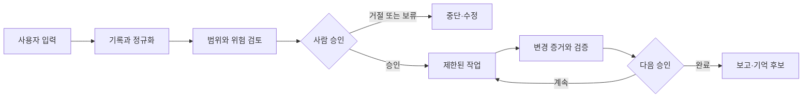

# Jarvis-Core Master Plan

이 문서는 Jarvis-Core의 전체 방향, 현재 작업 위치, 다음 승인 지점을 한곳에서 확인하기 위한 운영 계획서다.

세부 contract가 실제 구현 기준이며, 이 문서는 여러 contract와 앱의 상태를 한눈에 연결하는 상위 안내도다. 의미 있는 milestone이 끝날 때마다 이 문서의 `현재 위치`, `최근 완료`, `다음 단계`, `잠긴 기능`을 갱신한다.

## Owner Dashboard

### 최종 목표

여러 프로젝트와 AI 작업자를 한곳에서 관리하고, 사용자는 중요한 승인과
방향 결정만 수행한다. 기본 운영은 local-first이며 관찰, 제안, 승인, 실행을
서로 다른 단계로 유지한다.

### 현재 만드는 것

Memory / Skills의 privacy-review token, exact confirmation, one-claim write
시퀀스를 route-free internal/tests-only coordinator로 묶고, 중복을 보존하는
raw HTTP header 입력을 bounded request-guard metadata로 바꾸는 adapter까지
구현했다. 이어서 최초 session/cookie가 없는 bootstrap의 trust boundary와
lifecycle을 design-only 계약으로 확정했다. 저장 JSON은
`original_text_preview`를 기본 제외한다. 실제 HTTP route, UI, Voice Inbox,
runtime persistence에는 아무 권한도 추가하지 않았다.

### 이 작업 축이 끝나면 가능한 것

- preview, privacy review, token preparation, final confirmation, file write를
  서로 다른 권한 단계로 유지한다.
- client가 다시 보낸 candidate나 경로가 아니라 server-held canonical snapshot만
  저장 권한으로 사용할 수 있다.
- 실패, 재시도, restart, 중복 header, cross-session token을 fail closed로 다룬다.
- 저장 후보가 skill 승인이나 실행으로 자동 승격되는 일을 막는다.
- 조건이 모두 충족되기 전에는 현재 write-free preview만 계속 제공한다.

### 전체 성숙도

아래 막대는 일정이나 공수 비율이 아니라 `설계 → 내부 구현 → 통합 검증 →
사용자 기능 → 실사용 검증`의 성숙도 위치를 뜻한다.

```text
운영 기반       ████░  사용자 기능
역할별 앱       ████░  사용자 기능
안전 작업 운영  ████░  사용자 기능 — 실제 작업 1건 검증
Memory / Skills ██░░░  내부 coordinator 구현 — 저장 잠금
통합 Console    █░░░░  설계·기반
홈서버 / 모바일 █░░░░  장기 설계
```

상태 용어는 다음 의미로만 사용한다.

| 상태 | 의미 |
| --- | --- |
| 설계 | 방향과 안전 경계만 합의됐고 애플리케이션 코드는 없음 |
| 내부 구현 | 코드와 결정론적 테스트는 있으나 사용자 흐름에는 연결되지 않음 |
| 통합 검증 | 모듈 사이 연결과 end-to-end 로컬 검증까지 완료 |
| 사용자 기능 | 로컬 UI 또는 명확한 사용자 흐름에서 직접 사용할 수 있음 |
| 실사용 검증 | 실제 작업을 반복 수행하며 운영 피드백과 복구까지 확인됨 |

### 현재 위치와 다음 체감 목표

- 최근 완료: **Memory / Skills Phase 2C-4c session bootstrap contract review**
- 현재 다음 작업: **route-free bootstrap primitive — Phase 2C-4d, internal/tests-only 후보**
- 다음 사용자 체감 milestone: **모든 재오픈 조건을 통과한 명시적 local-save
  확인 흐름** — 아직 승인되지 않음
- vertical slice 완료 기준: 정확한 snapshot을 사람이 확인한 뒤 한 번만 저장하고,
  실패·restart·재시도에서도 자동 저장이나 실행 권한이 생기지 않음
- 현재 결정 필요: **있음** — 2C-4d 내부 구현을 진행할지 별도 승인 필요

### 언제부터 실제로 편해지는가

1. 현재: 각 로컬 도구와 수동 prompt drafting 기능을 사용할 수 있다.
2. 첫 체감 milestone: 안전 검증을 통과한 Codex 작업만 read-only 검토 화면에서
   확인한다.
3. 실용 로컬 milestone: 여러 프로젝트의 검토·승인·보고를 통합 Console에서
   관리하되 자동 실행과 push/PR은 계속 잠근다.
4. 장기 milestone: 화이트리스트 실행과 감사·복구가 검증된 뒤 모바일 승인을
   연결한다.

### 잠긴 고위험 기능

외부 API/LLM, 자동 실행, 자동 stage/commit/push/PR, Memory 저장, Voice
auto-save, background worker, 모바일 원격 실행은 현재 모두 잠겨 있다.
세부 목록과 재검토 조건은 아래 `잠긴 기능` 절을 따른다.

## 1. 한 문장 목표

Jarvis-Core를 **local-first, human-approved, skill-based personal AI assistant**의 지휘·기록·승인 중심축으로 발전시킨다.

Jarvis가 지향하는 기본 흐름은 다음과 같다.



자동화보다 승인 경계가 우선이다. 관찰, 제안, 승인, 실행은 서로 다른 단계이며 한 단계의 성공이 다음 단계의 권한을 자동으로 부여하지 않는다.

## 2. 현재 기준점

- Last verified: 2026-07-22
- Verified implementation HEAD: `d95233d8c7376192a986f00aed16ee6f1b2370fb`
- Branch: `main`
- Known protected untracked file: `jarvis.bat`
- Current workstream: Memory / Skills approval-gated local-save safety
- Current milestone: Phase 2C-4c session bootstrap contract review 완료, live save 잠금 유지
- Recommended next step: Phase 2C-4d route-free bootstrap primitive, separate approval required
- Next user-visible milestone: 모든 조건을 통과한 명시적 local-save 확인 흐름

Phase 2C-4a는 explicit privacy review가 있어야 preview token을 발급하고, exact
confirmation literal과 server-held canonical snapshot만 writer에 전달한다. Phase
2C-4b는 duplicate-preserving raw header pairs에서 exact single security header와
bounded Content-Length를 검증하고 request guard 입력을 만든다. 둘 다 route-free
internal/tests-only다. Phase 2C-4c는 bootstrap 전용 same-origin/no-body contract,
atomic issue/rotation, cookie/CSRF 전달, expiry/capacity/restart 경계를 설계만 했다.
저장 JSON은 `original_text_preview`를 제외한다. 현재 preview는 계속
write-free/token-free이고 save endpoint는 disabled/non-success다. UI Save/Confirm,
Voice Inbox auto-save, saved candidates dashboard도 없다.

## 3. 전체 단계

| 단계 | 완료 후 사용자가 할 수 있는 것 | 핵심 산출물 | 성숙도 | 다음 선행조건 |
| --- | --- | --- | --- | --- |
| 0. 운영 기반 | 작업·승인·결과를 같은 규칙으로 지시하고 보고받음 | task, 승인, 상태 전이, 보고 계약 | 사용자 기능 | 반복 실사용 검증 |
| 1. 역할별 앱 | 목적에 맞는 로컬 AI 도구를 분리해 사용함 | Research Council, Radar, Hermes, Console | 사용자 기능 | 실제 사용 피드백 |
| 2. 안전한 작업 운영 | 최신이며 범위 안인 Codex 작업만 검토함 | evidence, queue, copy-only handoff, read-only 검토 화면 | **사용자 기능 — 실제 작업 1건 검증** | 반복 사용 피드백 또는 다음 축 선택 |
| 3. Memory / Skills | 저장 전 후보를 확인하고 명시적으로 승인함 | write-free preview와 안전한 저장·복구 흐름 | 내부 coordinator·metadata adapter 구현과 bootstrap 설계, 저장 잠금 | route-free bootstrap primitive와 남은 재오픈 조건 |
| 4. 통합 Jarvis Console | 여러 프로젝트의 검토·승인·보고를 한 화면에서 관리함 | read-only부터 확장하는 local control panel | 설계·기반 | 2·3단계 안전 계약 안정화 |
| 5. 제한 실행과 모바일 승인 | 검증된 작업만 제한 실행하고 휴대폰에서 승인함 | 화이트리스트 executor, 감사 기록, 복구, 모바일 승인 | 장기 설계 | 로컬 실사용 검증 |

단계 번호는 방향을 설명한다. 모든 작업 축이 완전히 직렬로 진행된다는 뜻은 아니며, 안전 경계를 넘지 않는 작은 기반 작업은 병행할 수 있다.

## 4. 현재 위치: Memory / Skills 저장 재오픈 안전 결정

```mermaid
flowchart LR
    A["write-free preview<br/>Phase 2B"] --> B["path·dry-run·writer<br/>2C-0/1/2"]
    B --> C["storage hardening<br/>2C-3a"]
    C --> D["request guard·token<br/>2C-3b"]
    D --> E["재오픈 조건 검토<br/>2C-3c"]
    E --> F["개인정보 기본 미저장<br/>정책 확정"]
    F --> G["route-free save coordinator<br/>2C-4a"]
    G --> H["raw HTTP metadata adapter<br/>2C-4b"]
    H --> I["session bootstrap contract<br/>2C-4c design-only"]
    I --> J["route-free bootstrap primitive<br/>2C-4d 승인 후보"]
    J --> K["실제 HTTP·UI 통합<br/>모든 조건 충족 후"]

    classDef done fill:#d8ead8,stroke:#4d7d4d,color:#1f2d1f;
    classDef current fill:#fff0bf,stroke:#9b7412,color:#332600;
    classDef future fill:#e8e8e8,stroke:#777,color:#222;
    class A,B,C,D,E,F,G,H,I done;
    class J current;
    class K future;
```



### 구현된 기반

- write-free/token-free candidate preview
- repo-external local-state path validation과 save dry-run validation
- internal/tests-only hardened no-overwrite candidate writer
- bounded process-local `SessionRegistry`와 strict loopback `LocalRequestGuard`
- server-held canonical snapshot/digest와 one-time `PreviewTokenRegistry`
- live-save trust model, proposed approval sequence, mandatory reopen checklist
- explicit privacy review token issue와 exact confirmation literal
- one-claim fail-closed coordinator와 persisted source-preview 기본 제외
- duplicate-preserving bounded raw HTTP metadata adapter

### 최근 완료: Phase 2C-4c session bootstrap contract review

bootstrap은 기존 session/CSRF가 없는 첫 요청이므로 guarded-request adapter와
분리했다. 미래 요청은 explicit user action에서만 시작하며 exact loopback peer와
actual-port Host/Origin, POST, no query, `Content-Length: 0`을 요구한다.

세션은 process-local 64개, 30분 idle TTL, restart invalidation을 유지한다. 성공
시에만 session ID를 `HttpOnly`/`SameSite=Strict` cookie로, CSRF를 no-store JSON
body로 분리 전달한다. 이 credential은 이후 guard 시도만 허용하며 save, privacy
review, token issue, skill 승인 권한이 아니다.

### 다음 승인 지점: route-free bootstrap primitive — Phase 2C-4d

2C-4c 계약을 코드에 옮기되 실제 handler에는 연결하지 않는 internal/tests-only
단위다. bootstrap-specific raw metadata adapter와 atomic rotate-or-issue primitive,
private cookie material과 public JSON의 분리 결과, 결정론적 fake-clock/token
테스트만 허용한다.

```text
허용: route-free primitive와 deterministic tests
차단: route 등록, handler 연결, live session 발급, token route, save/UI 활성화
```

2C-4d는 별도 승인 전 진행하지 않는다. save endpoint, UI, Voice Inbox, runtime
persistence는 계속 별도 승인이다.

## 5. 작업 축별 상태

| 작업 축 | 현재 상태 | 사용자에게 보이는 기능 | 다음 안전 단계 |
| --- | --- | --- | --- |
| Hermes Manager | copy-only Jarvis handoff와 실제 작업 검증 완료 | prompt drafting과 수동 review handoff | 반복 실사용 피드백 대기 |
| Memory / Skills | Phase 2C-4c bootstrap contract 설계 완료, `keep locked` | write-free preview | Phase 2C-4d route-free bootstrap primitive |
| Jarvis Console | Codex Review 실제 작업 성공 화면 검증 완료 | fresh read-only work review | 반복 실사용 피드백 대기 |
| Research Council | 결정론적 로컬 research/report 앱 | 아이디어·가설·risk 평가 | 실제 사용 피드백 기반 품질 개선 |
| Daily AI Radar | 수동 curated metadata 기반 scout | local radar report | 실제 source 수집은 별도 승인 후 검토 |
| Task / Discord / Dashboard | task 생성·조회·승인·보고 기반 구현 | task workflow와 read-only dashboard | 전역 동작을 넓히지 않고 유지보수 |

## 6. 잠긴 기능

다음 항목은 구현 기반이 일부 존재하더라도 사용자 기능으로 활성화되지 않았다.

- `POST /api/memory-skills/candidates` save endpoint
- Memory / Skills UI Save 또는 Confirm
- Voice Inbox auto-save
- Saved candidates dashboard
- Hermes의 자동 Codex/ChatGPT 호출
- 자동 prompt rendering 또는 실행
- 자동 stage, commit, push, PR
- 외부 API, LLM, credential 생성·저장
- background worker, scheduler, unattended execution
- 모바일 승인 또는 홈서버 상시 실행

잠긴 기능은 관련 design/reopen 조건, local validation, self-review, 사용자 승인을 모두 통과한 별도 work package에서만 재검토한다.

## 7. 고정 안전 원칙

1. Local-first: 기본 동작은 로컬 deterministic 경계 안에 둔다.
2. Human-approved: 관찰 결과나 digest를 사람 승인으로 취급하지 않는다.
3. Small safe steps: 설계, primitive, integration, UI를 한 번에 열지 않는다.
4. Fail closed: 불완전하거나 오래되거나 범위 밖인 상태는 진행이 아니라 차단으로 분류한다.
5. No auto publish: push와 PR은 자동화하지 않는다.
6. Protected file: `jarvis.bat`는 명시적 별도 요청 없이는 touch/add/stage/commit하지 않는다.
7. No secrets: API key, token, credential, 민감 내용을 repo에 저장하지 않는다.
8. Evidence is not authority: hash와 manifest는 변경 감지 수단이며 신원·승인·실행 권한이 아니다.

## 8. 사용자 체감 전달 규칙

내부 primitive가 사용자 기능보다 끝없이 앞서지 않도록 다음 규칙을 적용한다.

1. 내부 구현 work package는 최대 2개까지만 연속 진행한다.
2. 그다음에는 반드시 사용자에게 보이는 작은 vertical slice를 완성한다.
3. 안전상 내부 작업이 더 필요하면 이유와 사용자 체감 milestone 지연을
   설명하고 소유자의 명시적 승인을 받는다.
4. C0C-6a 이후 허용된 다음 내부 단위는 C0C-6b 하나다.
5. C0C-6b 다음 기본 작업은 `Codex 작업 읽기 전용 검토 화면`이다.
6. vertical slice는 실제 로컬 작업 하나로 end-to-end 검증해야 완료로 기록한다.
7. read-only vertical slice는 자동 연결이 아닌 copy-only handoff로 실제 작업
   1건을 end-to-end 검증해 완료했다.
8. Memory / Skills는 2C-4a와 2C-4b로 내부 package 두 개를 완료했고, 소유자
   승인으로 2C-4c design review만 진행했다. 다음 2C-4d 내부 구현도 별도
   명시적 승인을 받은 뒤 진행한다.

## 9. Milestone 보고 형식

각 의미 있는 milestone 보고에는 다음을 포함한다.

1. Result type: design / implementation / review / commit / blocked
2. 변경 내용
3. 변경 파일
4. validation 결과
5. safety boundary 결과
6. commit hash
7. 최종 `git status --short`
8. 남은 risk
9. 다음 권장 단계와 승인 필요 여부
10. 소유자가 30초 안에 이해할 수 있는 `상사 보고 요약`

## 10. 이 문서 갱신 규칙

작은 내부 work package마다 이 문서를 수정하지 않는다. 관련 커밋 2~4개가
하나의 의미 있는 milestone을 만들었을 때 묶어서 갱신한다. 다음 사건은 즉시
갱신 사유다.

- milestone 완료
- 현재 작업 축 변경
- 사용자에게 보이는 기능 추가
- 잠긴 기능의 상태 변경
- 중요한 blocker 또는 설계 변경

갱신할 때는 다음 항목을 최소 확인한다.

1. Owner Dashboard의 현재 작업, 다음 체감 milestone, 결정 필요 항목
2. `현재 기준점`의 verified implementation HEAD와 milestone
3. `현재 위치`의 완료/현재/후속 표시
4. 작업 축별 `다음 안전 단계`
5. 새로 열렸거나 계속 잠겨 있는 기능

오래된 세부 문서를 삭제하지는 않는다. 대신 루트 README와 최신 checkpoint에서 이 문서를 현재 전체 방향의 시작점으로 링크한다.

## 11. 관련 기준 문서

- [Project North Star](project-north-star.md)
- [Architecture](architecture.md)
- [Jarvis development loop](jarvis-dev-loop.md)
- [Jarvis Console checkpoint](jarvis-console-v0.1-checkpoint.md)
- [Codex review read-only design](codex-review-read-only-v0.1-design.md)
- [Codex review copy-only handoff design](codex-review-copy-handoff-v0.1-design.md)
- [Memory / Skills design](memory-skills-v0.1-design.md)
- [Memory / Skills session bootstrap design](memory-skills-session-bootstrap-v0.1-design.md)
- [Hermes Manager README](../apps/hermes-manager-pilot/README.md)
- [Hermes Manager contract](../apps/hermes-manager-pilot/contracts/hermes-manager-pilot-v0.1.md)
