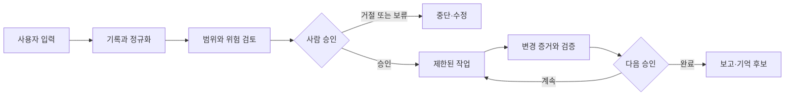

# Jarvis-Core Master Plan

이 문서는 Jarvis-Core의 전체 방향, 현재 작업 위치, 다음 승인 지점을 한곳에서 확인하기 위한 운영 계획서다.

세부 contract가 실제 구현 기준이며, 이 문서는 여러 contract와 앱의 상태를 한눈에 연결하는 상위 안내도다. 의미 있는 milestone이 끝날 때마다 이 문서의 `현재 위치`, `최근 완료`, `다음 단계`, `잠긴 기능`을 갱신한다.

## Owner Dashboard

### 최종 목표

여러 프로젝트와 AI 작업자를 한곳에서 관리하고, 사용자는 중요한 승인과
방향 결정만 수행한다. 기본 운영은 local-first이며 관찰, 제안, 승인, 실행을
서로 다른 단계로 유지한다.

### 현재 만드는 것

안전 검증을 통과한 Codex review session을 Jarvis Console의 읽기 전용 화면에서
확인하는 첫 vertical slice를 실제 Codex 작업으로 완료했다. Hermes가 정확한
handoff JSON을 만들고, 사용자가 복사하면 Jarvis가 fresh evidence를 다시 확인한다.

### 이 작업 축이 끝나면 가능한 것

- 오래됐거나 다시 변경된 Codex 작업을 검토 전에 차단한다.
- 승인 범위 밖 파일과 보호 파일 변경을 차단한다.
- 검토 가능한 작업만 읽기 전용 화면에 표시한다.
- 사용자가 모든 파일을 처음부터 일일이 확인해야 하는 부담을 줄인다.
- 검토 결과가 다음 승인이나 실행 권한으로 자동 승격되는 일은 없다.

### 전체 성숙도

아래 막대는 일정이나 공수 비율이 아니라 `설계 → 내부 구현 → 통합 검증 →
사용자 기능 → 실사용 검증`의 성숙도 위치를 뜻한다.

```text
운영 기반       ████░  사용자 기능
역할별 앱       ████░  사용자 기능
안전 작업 운영  ████░  사용자 기능 — 실제 작업 1건 검증
Memory / Skills ██░░░  내부 구현 — 저장 잠금
통합 Console    █░░░░  설계·기반
홈서버 / 모바일 █░░░░  장기 설계
```

상태 용어는 다음 의미로만 사용한다.

| 상태 | 의미 |
| --- | --- |
| 설계 | 방향과 안전 경계만 합의됐고 애플리케이션 코드는 없음 |
| 내부 구현 | 코드와 결정론적 테스트는 있으나 사용자 흐름에는 연결되지 않음 |
| 통합 검증 | 모듈 사이 연결과 end-to-end 로컬 검증까지 완료 |
| 사용자 기능 | 로컬 UI 또는 명확한 사용자 흐름에서 직접 사용할 수 있음 |
| 실사용 검증 | 실제 작업을 반복 수행하며 운영 피드백과 복구까지 확인됨 |

### 현재 위치와 다음 체감 목표

- 최근 완료: **Hermes → Jarvis copy-only handoff와 실제 작업 검증**
- 현재 다음 작업: **소유자가 다음 제품 작업 축을 선택**
- 다음 사용자 체감 milestone: **작업 축 선택 후 확정**
- vertical slice 완료 기준: 실제 Codex 작업 하나가 수집, 범위 검사, 최신성
  재확인, 검토 화면 표시까지 로컬에서 end-to-end로 통과함
- 현재 결정 필요: **Memory 2C-3c 설계** 또는 **read-only review 반복 실사용 개선**

### 언제부터 실제로 편해지는가

1. 현재: 각 로컬 도구와 수동 prompt drafting 기능을 사용할 수 있다.
2. 첫 체감 milestone: 안전 검증을 통과한 Codex 작업만 read-only 검토 화면에서
   확인한다.
3. 실용 로컬 milestone: 여러 프로젝트의 검토·승인·보고를 통합 Console에서
   관리하되 자동 실행과 push/PR은 계속 잠근다.
4. 장기 milestone: 화이트리스트 실행과 감사·복구가 검증된 뒤 모바일 승인을
   연결한다.

### 잠긴 고위험 기능

외부 API/LLM, 자동 실행, 자동 stage/commit/push/PR, Memory 저장, Voice
auto-save, background worker, 모바일 원격 실행은 현재 모두 잠겨 있다.
세부 목록과 재검토 조건은 아래 `잠긴 기능` 절을 따른다.

## 1. 한 문장 목표

Jarvis-Core를 **local-first, human-approved, skill-based personal AI assistant**의 지휘·기록·승인 중심축으로 발전시킨다.

Jarvis가 지향하는 기본 흐름은 다음과 같다.



자동화보다 승인 경계가 우선이다. 관찰, 제안, 승인, 실행은 서로 다른 단계이며 한 단계의 성공이 다음 단계의 권한을 자동으로 부여하지 않는다.

## 2. 현재 기준점

- Last verified: 2026-07-22
- Verified implementation HEAD: `2a63b4e6911738feb154be83b5e00a2a4010e7f8`
- Branch: `main`
- Known protected untracked file: `jarvis.bat`
- Current workstream: Hermes Manager의 안전한 Codex 작업 운영
- Current milestone: copy-only handoff와 실제 작업 1건의 fresh review 완료
- Recommended next implementation: 소유자 작업 축 선택 전 없음
- Next user-visible milestone: 선택한 작업 축에서 별도 정의

Hermes는 확인된 scope와 현재 read-only Git metadata로 정확한 `queue + item_id`
envelope를 만들고, 사용자가 이를 Jarvis에 직접 복사한다. 실제 현재 작업 1건이
Jarvis의 fresh evidence chain과 read-only 성공 화면까지 통과했다. 자동 호출,
저장, review/commit 승인, 실행 권한은 추가되지 않았다.

## 3. 전체 단계

| 단계 | 완료 후 사용자가 할 수 있는 것 | 핵심 산출물 | 성숙도 | 다음 선행조건 |
| --- | --- | --- | --- | --- |
| 0. 운영 기반 | 작업·승인·결과를 같은 규칙으로 지시하고 보고받음 | task, 승인, 상태 전이, 보고 계약 | 사용자 기능 | 반복 실사용 검증 |
| 1. 역할별 앱 | 목적에 맞는 로컬 AI 도구를 분리해 사용함 | Research Council, Radar, Hermes, Console | 사용자 기능 | 실제 사용 피드백 |
| 2. 안전한 작업 운영 | 최신이며 범위 안인 Codex 작업만 검토함 | evidence, queue, copy-only handoff, read-only 검토 화면 | **사용자 기능 — 실제 작업 1건 검증** | 반복 사용 피드백 또는 다음 축 선택 |
| 3. Memory / Skills | 저장 전 후보를 확인하고 명시적으로 승인함 | write-free preview와 안전한 저장·복구 흐름 | 내부 구현, 저장 잠금 | Phase 2C-3c reopen 조건 |
| 4. 통합 Jarvis Console | 여러 프로젝트의 검토·승인·보고를 한 화면에서 관리함 | read-only부터 확장하는 local control panel | 설계·기반 | 2·3단계 안전 계약 안정화 |
| 5. 제한 실행과 모바일 승인 | 검증된 작업만 제한 실행하고 휴대폰에서 승인함 | 화이트리스트 executor, 감사 기록, 복구, 모바일 승인 | 장기 설계 | 로컬 실사용 검증 |

단계 번호는 방향을 설명한다. 모든 작업 축이 완전히 직렬로 진행된다는 뜻은 아니며, 안전 경계를 넘지 않는 작은 기반 작업은 병행할 수 있다.

## 4. 현재 위치: 안전한 Codex 작업 검토

```mermaid
flowchart LR
    A["대상 변경 증거<br/>C0A/B"] --> B["전체 작업 상태 확인<br/>C0C-1"]
    B --> C["증거 묶음<br/>C0C-2"]
    C --> D["안전한 관찰값<br/>C0C-3/4"]
    D --> E["검토 가능 여부 분류<br/>C0C-5"]
    E --> F["작업 최신성 재확인<br/>C0C-6a"]
    F --> G["검토 세션 연결<br/>C0C-6b"]
    G --> H["읽기 전용 검토 화면<br/>구현·통합 검증"]
    H --> I["copy-only Hermes handoff<br/>실제 작업 검증"]
    I --> J["다음 제품 작업 축<br/>소유자 결정"]

    classDef done fill:#d8ead8,stroke:#4d7d4d,color:#1f2d1f;
    classDef current fill:#fff0bf,stroke:#9b7412,color:#332600;
    classDef future fill:#e8e8e8,stroke:#777,color:#222;
    class A,B,C,D,E,F,G,H,I done;
    class J current;
```



### 구현된 기반

- Prompt Queue schema와 보수적 evaluator
- scope/review/commit approval digest binding
- 정확한 target 파일의 bounded content evidence
- 전체 Git-visible worktree status evidence
- target evidence와 whole-status evidence의 composite bundle
- protected/out-of-scope 변경을 차단하는 handoff decision
- verified observation을 새 immutable queue item에 적용하는 adapter
- observation queue를 기존 evaluator로 분류하는 C0C-5 pure bridge
- 실제 working tree를 다시 수집해 stale observation을 차단하는 C0C-6a
- fresh preview만 exact review-only `SessionState`로 변환하는 C0C-6b
- approved queue를 다시 검증해 bounded session fields만 표시하는 Jarvis Console
  read-only 화면과 임시 저장소 통합 검증
- confirmed scope를 정확한 `queue + item_id` envelope로 만드는 Hermes copy-only
  handoff와 실제 Codex 작업 1건의 fresh read-only 검증

### 최근 완료: copy-only handoff와 실제 작업 검증

C0C-6a는 Codex 보고 이후 실제 working tree가 달라졌는지 다시 확인하고,
C0C-6b는 그 검증을 통과한 preview만 기존 로컬 review `SessionState`로
안전하게 변환한다. 두 단위는 internal/tests-only로 완료됐다.

Jarvis Console의 write-free POST preview와 `Codex Review` 탭에 이어, Hermes
Step 5가 exact `queue + item_id` envelope를 생성하는 copy-only handoff를 제공한다.
실제 현재 Codex 작업 1건이 Hermes scope 확인, JSON copy, Jarvis item-ID 인식,
fresh evidence, read-only 성공 화면까지 통과했다. review는 승인되지 않았고
commit/push와 prompt/command 실행은 비활성으로 유지됐다.

### 현재 결정: 다음 제품 작업 축

첫 안전 작업 vertical slice의 완료 기준을 충족했다. 다음 구현은 자동으로
이어가지 않고 소유자가 아래 두 방향 중 하나를 선택한다.

```text
1. Memory / Skills Phase 2C-3c design/reopen 조건 검토만 수행
2. read-only Codex Review를 실제 작업에 반복 사용하고 UX finding만 수집·수정
```

어느 방향도 save endpoint, 자동 handoff, persistence, 승인 생성, prompt 실행,
자동 commit/push를 허용하지 않는다. 작업 축 선택은 제품 방향 결정이므로
소유자 승인 전 새 구현을 시작하지 않는다.

## 5. 작업 축별 상태

| 작업 축 | 현재 상태 | 사용자에게 보이는 기능 | 다음 안전 단계 |
| --- | --- | --- | --- |
| Hermes Manager | copy-only Jarvis handoff와 실제 작업 검증 완료 | prompt drafting과 수동 review handoff | 반복 실사용 피드백 대기 |
| Memory / Skills | Phase 2B preview와 2C-0/1/2/3a/3b 내부 primitive 구현 | write-free preview | Phase 2C-3c reopen 조건 설계 |
| Jarvis Console | Codex Review 실제 작업 성공 화면 검증 완료 | fresh read-only work review | 다음 제품 축 선택 |
| Research Council | 결정론적 로컬 research/report 앱 | 아이디어·가설·risk 평가 | 실제 사용 피드백 기반 품질 개선 |
| Daily AI Radar | 수동 curated metadata 기반 scout | local radar report | 실제 source 수집은 별도 승인 후 검토 |
| Task / Discord / Dashboard | task 생성·조회·승인·보고 기반 구현 | task workflow와 read-only dashboard | 전역 동작을 넓히지 않고 유지보수 |

## 6. 잠긴 기능

다음 항목은 구현 기반이 일부 존재하더라도 사용자 기능으로 활성화되지 않았다.

- `POST /api/memory-skills/candidates` save endpoint
- Memory / Skills UI Save 또는 Confirm
- Voice Inbox auto-save
- Saved candidates dashboard
- Hermes의 자동 Codex/ChatGPT 호출
- 자동 prompt rendering 또는 실행
- 자동 stage, commit, push, PR
- 외부 API, LLM, credential 생성·저장
- background worker, scheduler, unattended execution
- 모바일 승인 또는 홈서버 상시 실행

잠긴 기능은 관련 design/reopen 조건, local validation, self-review, 사용자 승인을 모두 통과한 별도 work package에서만 재검토한다.

## 7. 고정 안전 원칙

1. Local-first: 기본 동작은 로컬 deterministic 경계 안에 둔다.
2. Human-approved: 관찰 결과나 digest를 사람 승인으로 취급하지 않는다.
3. Small safe steps: 설계, primitive, integration, UI를 한 번에 열지 않는다.
4. Fail closed: 불완전하거나 오래되거나 범위 밖인 상태는 진행이 아니라 차단으로 분류한다.
5. No auto publish: push와 PR은 자동화하지 않는다.
6. Protected file: `jarvis.bat`는 명시적 별도 요청 없이는 touch/add/stage/commit하지 않는다.
7. No secrets: API key, token, credential, 민감 내용을 repo에 저장하지 않는다.
8. Evidence is not authority: hash와 manifest는 변경 감지 수단이며 신원·승인·실행 권한이 아니다.

## 8. 사용자 체감 전달 규칙

내부 primitive가 사용자 기능보다 끝없이 앞서지 않도록 다음 규칙을 적용한다.

1. 내부 구현 work package는 최대 2개까지만 연속 진행한다.
2. 그다음에는 반드시 사용자에게 보이는 작은 vertical slice를 완성한다.
3. 안전상 내부 작업이 더 필요하면 이유와 사용자 체감 milestone 지연을
   설명하고 소유자의 명시적 승인을 받는다.
4. C0C-6a 이후 허용된 다음 내부 단위는 C0C-6b 하나다.
5. C0C-6b 다음 기본 작업은 `Codex 작업 읽기 전용 검토 화면`이다.
6. vertical slice는 실제 로컬 작업 하나로 end-to-end 검증해야 완료로 기록한다.
7. read-only vertical slice는 자동 연결이 아닌 copy-only handoff로 실제 작업
   1건을 end-to-end 검증해 완료했다.

## 9. Milestone 보고 형식

각 의미 있는 milestone 보고에는 다음을 포함한다.

1. Result type: design / implementation / review / commit / blocked
2. 변경 내용
3. 변경 파일
4. validation 결과
5. safety boundary 결과
6. commit hash
7. 최종 `git status --short`
8. 남은 risk
9. 다음 권장 단계와 승인 필요 여부
10. 소유자가 30초 안에 이해할 수 있는 `상사 보고 요약`

## 10. 이 문서 갱신 규칙

작은 내부 work package마다 이 문서를 수정하지 않는다. 관련 커밋 2~4개가
하나의 의미 있는 milestone을 만들었을 때 묶어서 갱신한다. 다음 사건은 즉시
갱신 사유다.

- milestone 완료
- 현재 작업 축 변경
- 사용자에게 보이는 기능 추가
- 잠긴 기능의 상태 변경
- 중요한 blocker 또는 설계 변경

갱신할 때는 다음 항목을 최소 확인한다.

1. Owner Dashboard의 현재 작업, 다음 체감 milestone, 결정 필요 항목
2. `현재 기준점`의 verified implementation HEAD와 milestone
3. `현재 위치`의 완료/현재/후속 표시
4. 작업 축별 `다음 안전 단계`
5. 새로 열렸거나 계속 잠겨 있는 기능

오래된 세부 문서를 삭제하지는 않는다. 대신 루트 README와 최신 checkpoint에서 이 문서를 현재 전체 방향의 시작점으로 링크한다.

## 11. 관련 기준 문서

- [Project North Star](project-north-star.md)
- [Architecture](architecture.md)
- [Jarvis development loop](jarvis-dev-loop.md)
- [Jarvis Console checkpoint](jarvis-console-v0.1-checkpoint.md)
- [Codex review read-only design](codex-review-read-only-v0.1-design.md)
- [Codex review copy-only handoff design](codex-review-copy-handoff-v0.1-design.md)
- [Memory / Skills design](memory-skills-v0.1-design.md)
- [Hermes Manager README](../apps/hermes-manager-pilot/README.md)
- [Hermes Manager contract](../apps/hermes-manager-pilot/contracts/hermes-manager-pilot-v0.1.md)
